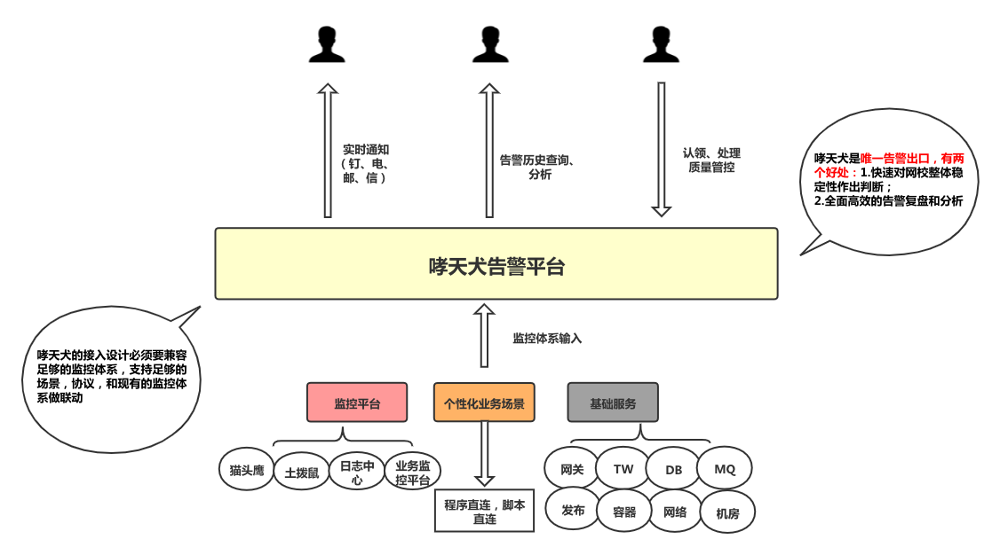

# 哮天犬监控告警平台

哮天犬是一个通用的统一告警平台，提供配置化、流程化、标准化的能力。可以选择对接日志中心日志类监控、实时计算类的监控能力，各业务方也可以直接在代码中埋点上报告警，同时我们团队也可以定制化开发既能满足业务需求又能快速复用告警平台的监控系统，实现监控告警全场景覆盖。

作为监控告警系统的最后一环，哮天犬作为告警平台，承接各监控系统的接入，必须要兼容各监控系统，支持足够多的场景，形成标准化的告警平台，统一输入，不同输出。

  

- [管理后台](https://alarm-dog.domain.com/)
- [快速入门](./alarm/quick-start.md)
- [告警接口API](./alarm/alarm-api.md)
