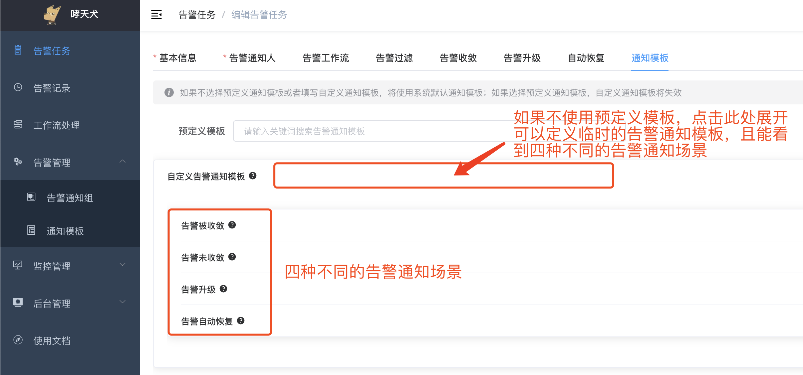
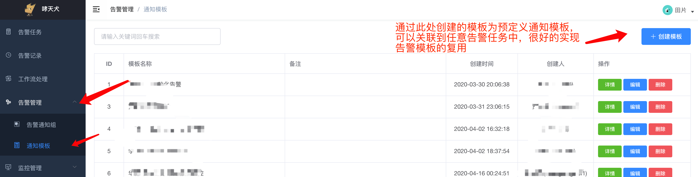
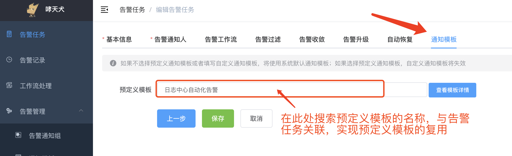
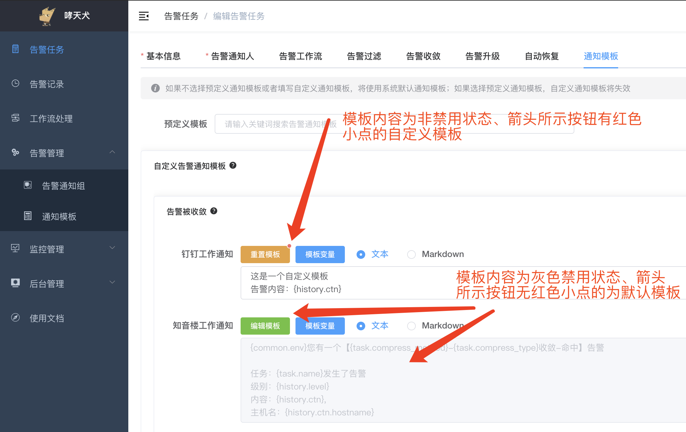

告警通知模板提供了根据告警内容组装发送内容的能力，比如告警内容中发送的都是json，可以将json中的数据组合发送到通知人。

## 通知模板配置

暂且先不说预定义、自定义和默认模板的区别，先说下通知模板如何配置。

比如现在有一个告警，告警内容为一个复杂的JSON，如下所示（为简化，下面其他示例只会展示 `ctn` 字段的内容）：

```bash
curl -X POST 'https://alarm-dog-service.domain.com/alarm/report' \
    -H 'Content-Type: application/json' \
    -d '{
        "taskid": 123,
        "timestamp": 1592378746,
        "sign": "c039ad9a37a8b88ad59d200ac7d10c56",
        "ctn": {
            "errno": 10086,
            "error": "您的余额已不足",
            "context": {
                "class": {
                    "id": 111,
                    "name": "哮天犬演示课"
                },
                "time": {
                    "date": "2020-06-17",
                    "time": "15:30:00"
                }
            }
        },
        "level": 1,
        "notice_time": 1592378746
    }'
```

我们可以在通知模板中配置如下模板：

```
您有一条告警，请注意处理
错误码：{history.ctn.errno}
错误信息：{history.ctn.error}
课程：{history.ctn.context.class.name}（ID：{history.ctn.context.class.id}）
时间：{history.ctn.context.time}
Host：{history.ctn.hostname}
```

我们接收到告警的内容将是：

```
您有一条告警，请注意处理
错误码：10086
错误信息：您的余额已不足
课程：哮天犬演示课（ID：111）
时间：{"date": "2020-06-17", "time": "15:30:00"}
Host：{history.ctn.hostname}
```

从上面的示例可以看出，告警模板实际上是将模板中格式为 `{}` 的特殊标记（以下都称为模板变量）替换为告警内容中JSON对应key的值，如果值为标量，则原样输出，例如 `{history.ctn.errno}`；如果值为非标量，则输出为JSON字符串，例如 `{history.ctn.context.time}`；如果对应的key不存在，则不进行替换，例如 `{history.ctn.hostname}`。

模板变量可以通过小数点 `.` 访问无限层级的JSON对象[<sup>[概念介绍]</sup>](../preface/concept.md#json数据类型)，例如 `ctn`、`context`、`class` 均为JSON对象，所以可以通过 `{history.ctn.context.class.name}` 访问到 `class` 对象中的 `name` 的值。

我们还发现 `ctn` 字段外层还有一个 `history` 字段，这个字段相当于是命名空间，因为哮天犬提供了很多模板变量，为了很好的区分各变量的含义，故在变量的前面加了命名空间。`history` 表示的是告警记录这组变量的命名空间，哮天犬还提供了其他的可以变量，请参考[可用模板变量](#可用模板变量)。


## 模板场景

告警场景主要是根据四种不同需要告警发送的高级功能出现的，包括告警被收敛、告警未收敛、告警升级、告警恢复四种场景。告警属于哪种模板场景就是用哪个场景下的模板发送告警。

  


### 告警被收敛

即告警任务开启了告警收敛功能，且告警命中了收敛规则，此时会以告警被收敛的场景发送告警。


### 告警未收敛

即告警未开启收敛功能，或者开启了收敛功能但未命中收敛规则，此时会以告警未收敛的场景发送告警。


### 告警升级

即告警开启了告警升级功能，且触发了告警升级，此时会以告警升级的场景发送告警。


### 告警恢复

即告警开启了告警恢复功能，且触发了告警恢复，此时会以告警恢复的场景发送告警。


## 模板类型

告警模板分为三种类型，分别为预定义模板、自定义模板、默认模板。


### 预定义模板

预定义模板指的是通过在哮天犬后台 【告警管理 / 通知模板】菜单创建的模板，此处的模板可以关联到任意告警任务中，可以很好的实现告警模板的复用。预定义模板里面每个告警场景、告警通知渠道有可能是自定义模板或者默认模板，但至少有一个是自定义模板。

  

  


### 自定义模板

如图所示，某个告警场景的告警通知渠道模板内容被修改，这种模板属于自定义模板，即被修改过的模板。自定义模板能根据自己想要的格式进行修改，能增加告警的可读性，建议修改默认模板。

  


### 默认模板

如上图所示，模板没有做任何修改，这种模板为默认模板。默认模板发送时会使用系统默认的模板发送告警，有可能存在哮天犬平台调整默认模板导致告警发送内容稍有差异。且为了能使任何告警内容输出，告警内容会以 `{history.ctn}` 的模板变量使用JSON的形式发送到通知人，可能会影响可读性，建议配置告警模板。


## 可用模板变量

### 告警收敛场景

- `task`：告警任务信息
  - `task.id`: 告警任务ID
  - `task.name`: 告警任务名称
- `history`: 告警记录
  - `history.id`: 告警记录ID
  - `history.uuid`: 告警记录唯一ID
  - `history.batch`: 收敛批次
  - `history.metric`: 收敛指标
  - `history.notice_time`: 告警通知时间
  - `history.level`: 告警级别
  - `history.ctn`: 告警内容
  - `history.receiver`: 自定义通知人配置，JSON格式，如果未传则为空
- `common`: 系统变量
  - `common.env`: 环境标识，例如 [生产环境]、[测试环境]


### 告警未收敛场景

- `task`：告警任务信息
  - `task.id`: 告警任务ID
  - `task.name`: 告警任务名称
- `history`: 告警记录
  - `history.uuid`: 告警记录唯一ID
  - `history.notice_time`: 告警通知时间
  - `history.level`: 告警级别
  - `history.ctn`: 告警内容
  - `history.receiver`: 自定义通知人配置，JSON格式，如果未传则为空
- `common`: 系统变量
  - `common.env`: 环境标识，例如 [生产环境]、[测试环境]


### 告警升级场景

- `task`：告警任务信息
  - `task.id`: 告警任务ID
  - `task.name`: 告警任务名称
- `context`: 上下文配置信息
  - `context.rule`: 当前告警升级规则配置，JSON格式
  - `context.zcount`: 触发规则的计数值
- `history`: 告警记录
  - `history.id`: 告警记录ID
  - `history.uuid`: 告警记录唯一ID
  - `history.batch`: 收敛批次
  - `history.metric`: 收敛指标
  - `history.notice_time`: 告警通知时间
  - `history.level`: 告警级别
  - `history.ctn`: 告警内容
  - `history.receiver`: 自定义通知人配置，JSON格式，如果未传则为空
- `common`: 系统变量
  - `common.env`: 环境标识，例如 [生产环境]、[测试环境]


### 告警恢复场景

- `task`：告警任务信息
  - `task.id`: 告警任务ID
  - `task.name`: 告警任务名称
- `history`: 告警记录
  - `history.uuid`: 告警记录唯一ID
  - `history.notice_time`: 告警通知时间
  - `history.level`: 告警级别
  - `history.ctn`: 告警内容
  - `history.receiver`: 自定义通知人配置，JSON格式，如果未传则为空
- `common`: 系统变量
  - `common.env`: 环境标识，例如 [生产环境]、[测试环境]


