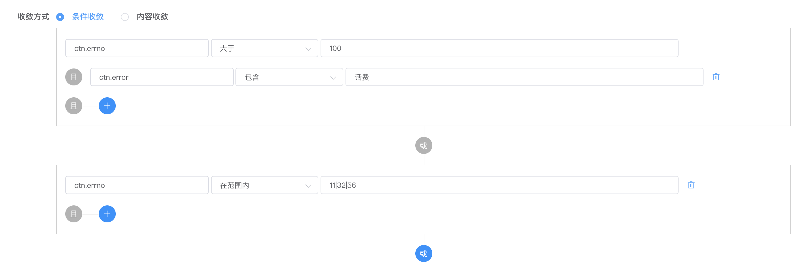
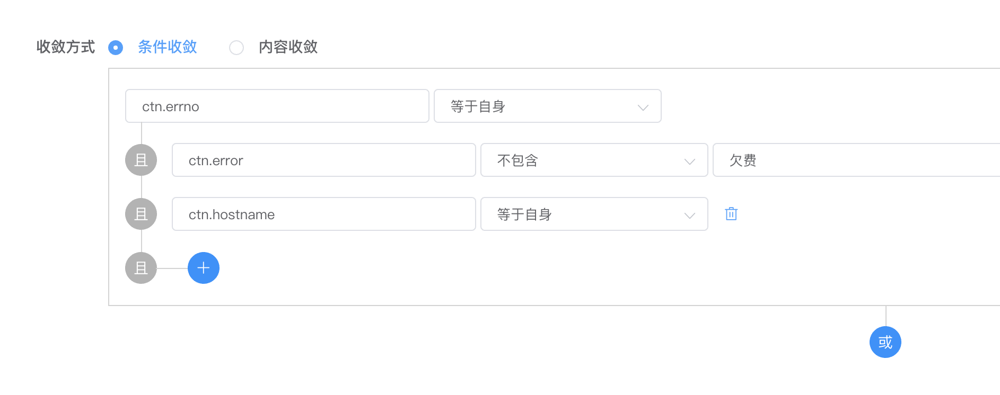

告警收敛是把同类型告警压缩，在一定周期内只发送有限数量的告警，大大减少重复告警发送，提高告警效率，降低告警疲劳。这里所说的同类型告警指的是满足一定条件的告警，这个条件是可配置的，可以是逻辑运算单元，可以是告警内容，也可以是整个告警任务。

  

告警收敛默认是关闭的，需要在创建告警任务时，将选项卡切换到告警收敛，然后点击状态开关开启告警收敛。

告警收敛配置分为收敛方式、收敛策略、未命中收敛三部分，其中收敛方式解决的是上面所说的满足一定条件的告警的条件，即配置条件将什么样的告警视为同一类告警；收敛策略解决的是上面所说的在一定周期内只发送有限数据的告警，即同类型告警如何发送；未命中收敛解决的是收敛方式中归类告警存在盲区时，如果处理进入收敛盲区的告警。下面将详细介绍这三部分功能如何配置。

下面内容会比较复杂，请谅解🙏🙏🙏


# 目录导航

[[toc]]


# 收敛方式

收敛方式表示以什么样的方式将发送过来的告警进行归类，将什么样的告警视为同一类告警。目前提供了条件收敛和内容收敛两种方式。

::: tip 怎么找到告警内容？
如果您是通过类似于日志中心自动化告警这种监控系统接入的，您可以通过这种方式找到告警内容，请移步：[怎么找到告警内容](../faq/how-to-find-alarm-content.md)。
:::


## 收敛方式-条件收敛

条件收敛即配置一系列条件组成逻辑运算单元，断言是否满足收敛条件。下图是一组逻辑运算单元：

  

使用逻辑运算表达式表示为：`( ctn.errno > 100 && ctn.error like "话费" ) || ( ctn.errno in [11, 32, 56] )`。

首先，这里的 `ctn.errno` 表示告警内容中的 `errno` 的值，例如现有告警如下：

```bash
curl -X POST 'https://alarm-dog-service.domain.com/alarm/report' \
    -H 'Content-Type: application/json' \
    -d '{
        "taskid": 123,
        "timestamp": 1592408121,
        "sign": "c039ad9a37a8b88ad59d200ac7d10c56",
        "ctn": {
            "errno": 10086,
            "error": "[话费通知]您的余额已不足"
        }
    }'
```

此时的告警收敛状态为：

```
ctn.errno = 10086
ctn.error = "[话费通知]您的余额已不足"

# 收敛逻辑运算表达式为
( ctn.errno > 100 && ctn.error like "话费" ) || ( ctn.errno in [11, 32, 56] )
# 代入变量的值为
( 10086 > 100 && "[话费通知]您的余额已不足" like "话费" ) || ( 10086 in [11, 32, 56] )
    = ( true && true ) || ( false )
    = true || false
    = true
```

通过上述运算可知，上面的告警是命中收敛的，即告警被收敛了。假如现在有另外一个告警，告警内容如下：

```json
{
    "ctn": {
        "errno": 10010,
        "error": "联通来送话费了"
    }
}
```

此时的收敛状态为：

```
ctn.errno = 10010
ctn.error = "联通来送话费了"

# 收敛逻辑运算表达式为
( ctn.errno > 100 && ctn.error like "话费" ) || ( ctn.errno in [11, 32, 56] )
# 代入变量的值为
( 10010 > 100 && "联通来送话费了" like "话费" ) || ( 10010 in [11, 32, 56] )
    = ( true && false ) || ( false )
    = false || false
    = false
```

通过上述运算可知，上面的告警没有命中收敛规则，即告警未被收敛。

上文介绍过收敛是把同类型告警压缩，那么什么是同类型告警呢？从上面的运算过程演示可知，满足收敛条件的即为收敛，否则不收敛，那么这样就会出现，满足收敛条件的是一类告警，不满足的是其他类型（不能说是另一类，因为并没有对未收敛的告警再次进行归类）的告警。这样会导致告警要么被压缩到同一类里面，要么就是其他类告警，极容易出现告警误收敛。为了解决这个问题，我们先将上面两个运算使用我们熟悉的SQL语句表示，改写为伪SQL语句：

```sql
SELECT COUNT(*) FROM `ctn` WHERE (`ctn.errno` > 100 AND `ctn.error` like '%话费%') OR ( `ctn.errno` IN (11, 32, 56));
```

被收敛时，`COUNT(*)` 的值为 `1`，未被收敛时，`COUNT(*)` 的值为 `0`。

假设我们把SELECT出来的数据使用算法算出唯一值作为告警分类的依据，我们会发现跟上面文字分析完全一致，告警要么被收敛都为同一类告警，假设为 `hash(COUNT(*))`，要么未被收敛，无法计算告警分类依据，

说到这里，大家估计想到了使用MySQL的`GROUP BY`来增加告警类型区分度，假设我们以 `ctn.errno` 作为一个G`ROUP BY`的条件，那么我们可以改下SQL为：

```sql
SELECT COUNT(*), `ctn.errno` FROM `ctn` WHERE (`ctn.errno` > 100 AND `ctn.error` like '%话费%') OR ( `ctn.errno` IN (11, 32, 56))
    GROUP BY `ctn.errno`;
```

使用`GROUP BY`之后，我们发现每一个新的 `ctn.errno`，都可以算出一个不同的告警类型标记：`hash(COUNT(*), ctn.errno)`，这样就达到了更细粒度的将收敛告警分类。由于必须配置收敛条件来区分告警属于哪一类，告警收敛条件至少配置一个，所以使用`GROUP BY`这种形式还可以规避收敛条件盲区，例如下面的收敛SQL在 `ctn.errno = 12` 时存在盲区：

```sql
SELECT COUNT(*) FROM `ctn` WHERE (`ctn.errno` > 100 AND `ctn.error` like '%话费%') OR ( `ctn.errno` IN (11, 32, 56));
```

如果改成了无盲区的形式，可能长这样：

```sql
SELECT COUNT(*) FROM `ctn` WHERE (`ctn.errno` > 100 ) OR ( `ctn.errno` <= 100 );
```

那这样修改之后，所有的告警全部被收敛到了 `hash(COUNT(*))`，那收敛就没意义了。

如果使用`GROUP BY`的这种形式，就能解决这种问题：

```sql
SELECT COUNT(*), `ctn.errno` FROM `ctn` GROUP BY `ctn.errno`;
```

满足了至少配置一个收敛条件 `GROUP BY ctn.errno`，也去掉了 WHERE 条件完全无盲区。

铺垫了这么多，下面进入正题。为了提高收敛区分度，哮天犬增加了**等于自身**的收敛条件来实现类似于MySQL的`GROUP BY`的同等作用，例如如下配置用SQL表示为：

  

```sql
SELECT COUNT(*) FROM `ctn` WHERE ( `ctn.error` not like '%欠费%') GROUP BY `ctn.errno`, `ctn.hostname`;
```

讲了这么多，字段、条件、阈值知道怎么填了，下面再详细介绍一下字段、条件、阈值如何填写。


### 条件收敛-字段

字段支持使用小数点`.`访问无限层级的JSON对象[<sup>[概念介绍]</sup>](../preface/concept.md#json数据类型)里面的值，例如现在有一个告警为：

```bash
curl -X POST 'https://alarm-dog-service.domain.com/alarm/report' \
    -H 'Content-Type: application/json' \
    -d '{
        "taskid": 123,
        "timestamp": 1592378746,
        "sign": "c039ad9a37a8b88ad59d200ac7d10c56",
        "ctn": {
            "errno": 10086,
            "error": "您的余额已不足",
            "context": {
                "class": {
                    "id": 111,
                    "name": "哮天犬演示课"
                },
                "time": {
                    "date": "2020-06-17",
                    "time": "15:30:00"
                }
            }
        },
        "level": 1,
        "notice_time":
    }'
```

我们要访问 `ctn` 字段下面的 `errno`，我们可以使用 `ctn.errno`，如果要访问 `name`，可以使用 `ctn.context.class.name`。可以很容易看出可使用的字段为告警请求参数里面的字段。但由于我们这边设计的缺陷，暂时只支持`ctn`字段，不支持`taskid`、`level`、`notice_time`等字段。


### 条件收敛-条件

条件收敛支持很多种条件，下面一一介绍：


#### 等于自身
   
这个条件上面已有详细介绍，主要起到类似于MySQL `GROUP BY`的效果，每一个新的对应字段的值都是一个新的告警类型。例如现在有条件 `ctn.errno 等于自身`，当 `ctn.errno = 10086` 时是一个新的告警类型，如果下次还有一个告警 `ctn.errno = 10086`，则该告警跟之前的 `ctn.errno` 都是同一类告警，会收敛到一起。当下一条告警为 `ctn.errno = 10010` 时，则又是新的一类告警，不会和之前的 `ctn.errno = 10086` 收敛到一起。如果下次又有告警 `ctn.errno = 10086`，则他不会跟 `ctn.errno = 10010` 的告警收敛到一起，而是会和 `ctn.errno = 10086` 的收敛到一起。


#### 等于

与常规的运算符 `=` 的效果一致，假如现在有条件 `ctn.errno 等于 10086`，现在有告警 `ctn.errno = 10086` 则被收敛，告警 `ctn.errno = 10010` 因无法满足收敛条件而未被收敛。


#### 不等于

与常规的运算符 `!=` 的效果一致，与**等于**的效果正好相反。


#### 字段存在

与PHP语言中的 `isset`，JavaScript中的 `object.key === undefined` 效果一致，假如有条件 `ctn.errno 字段存在`，则告警内容为下面的JSON对象时收敛条件为真，命中收敛：

```json
{
    "ctn": {
        "errno": 10086,
        "error": "余额已不足"
    }
}
```

如果告警内容为下面的JSON对象时因key `errno` 不存在，收敛条件为假，未命中收敛：

```json
{
    "ctn": {
        "error": "余额已不足"
    }
}
```


#### 字段不存在

与PHP语言中的 `!isset`，JavaScript中的 `object.key !== undefined` 效果一致，与**字段存在**的效果正好相反。


#### 小于

与常规的运算符 `<` 的效果一致，假如现在有条件 `ctn.errno 小于 10086`，有告警 `ctn.errno = 10010` 则被收敛，告警 `ctn.errno = 10000` 也被收敛，告警 `ctn.errno = 10086` 因无法满足收敛条件而未被收敛。


#### 大于

与常规的运算符 `>` 的效果一致。


#### 不大于

与常规的运算符 `<=` 的效果一致，与**大于**的效果正好相反。


#### 不小于

与常规的运算符 `>=` 的效果一致，与**小于**的效果正好相反。


#### 在范围内

与SQL里面的 `in` 类似，假如现在有条件 `ctn.errno 在范围内 10010|10000|10086`，有告警 `ctn.errno = 10010` 满足 `ctn.errno in (10010. 10000. 10086)` 条件，则告警被收敛，告警 `ctn.errno = 10086` 同样被收敛，告警 `ctn.errno = 123` 因不在范围内而未被收敛。

从示例可以看出，在范围内要配置多个阈值，多个阈值使用英文半角 `|` 进行分隔。


#### 不在范围内

与SQL里面的 `not in` 类似，与**在范围内**的效果正好相反，阈值同样以 `|` 进行分隔。


#### 包含

与SQL里面的 `like` 类似，假如现在有条件 `ctn.error 包含 余额`，有告警 `ctn.error = 您的余额已不足`，由于内容里面包含 `余额` ，满足条件，告警被收敛；告警 `ctn.error = 请及时缴纳话费` 因不包含 `余额` 而未被收敛。


#### 不包含

与SQL里面的 `not like` 类似，与**包含**的效果正好相反。


### 条件收敛-阈值

阈值是与条件配合使用的参考值，有些条件不需要阈值，例如 **等于自身**、**字段存在**、**字段不存在**。有一些要求配置多个阈值，例如 **在范围内**、**不在范围内**，多个阈值以英文半角`|`符号进行分隔。

哮天犬使用弱类型语言PHP开发，不强制区分数字、字符串，所以在填写阈值时字符串类型一定不可以写成 `"余额"`、`'余额'`这种形式，会导致条件匹配时会匹配错误。


### 条件收敛-逻辑运算单元

收敛条件是支持逻辑运算的，上面已有详细示例进行介绍，这里不再重复介绍逻辑运算的过程。为了保证收敛效果，哮天犬的条件配置在 `AND` 逻辑单元内不区分先后顺序，例如 `( ctn.errno 大于 100 && ctn.error 包含 "话费" )` 和 `( ctn.error 包含 "话费" && ctn.errno 大于 100 )` 的效果是一致的。

哮天犬的 `OR` 逻辑单元是使用懒惰匹配的，当前面的逻辑单元匹配条件成功，则立马结束其他逻辑单元的匹配，例如现在有逻辑单元 `( ctn.errno 大于 100 && ctn.error 包含 "话费" ) OR ( ctn.errno 大于 10 )`，现有告警 `ctn.errno = 200`，则匹配到逻辑单元 `( ctn.errno 大于 100 && ctn.error 包含 "话费" )` 时已匹配成功，终止继续匹配，即使满足 `( ctn.errno 大于 10 )` 也不再继续进行匹配。告警 `ctn.errno = 20` 因不满足第一个条件，才能匹配第二个条件。


## 收敛方式-内容收敛

哮天犬还提供了另外一种收敛方式：内容收敛，即相同的告警内容收敛到一起，是一个简单粗暴的收敛方式，例如下面两个告警会收敛到一起：

```json
{
    "ctn": {
        "errno": 10086,
        "error": "您的余额已不足"
    }
}
```

```json
{
    "ctn": {
        "error": "您的余额已不足",
        "errno": 10086
    }
}
```

即使JSON对象里面的key的顺序变化了，但是真正的内容没有变化，仍然视为同一类告警，下面的告警就不会跟上面的收敛到一起：

```json
{
    "ctn": {
        "errno": 10086,
        "error": "您的余额已不足",
        "username": "foo"
    }
}
```


## 收敛方式-全量收敛

全量收敛是一个非常简单粗暴的收敛方式，只要发送到该任务的告警都被认为是同一类告警进行收敛，无论他们的结构是否一致、内容是否一致。

***如果告警会因告警内容、结构带来不同的信息，建议不要使用该收敛方式，可能导致重要告警被误收敛。***


# 收敛策略

收敛策略表示以什么样的策略在一定周期内只发送有限数量的告警，目前提供了一下几种策略。


## 收敛策略-周期收敛

周期收敛只在配置的周期内只发送一条告警，且是在周期开始的时候。在周期开始时发送告警不用担心收敛不满足策略导致告警发送不出来，是一种非常简单有效的收敛策略。在周期结束之后，会立马重置收敛的告警进入可发送告警的状态。周期收敛并不是不停的计算收敛周期，而是在有消费到告警时才开始计算周期，如果周期结束了，没有新的告警被消费，则不会开始新的一轮周期，直至有新的告警被消费为止。


## 收敛策略-延迟收敛

延迟收敛也是只在配置的周期内只发送一条告警，但是是在周期结束的时候。延迟收敛跟周期收敛类似，只不过一个是在周期开始发送告警，一个是在周期结束发送告警。由于延迟收敛大量使用定时器，无法非常精准的在周期末发送告警，例如配置的周期是1分钟，但告警并不一定是在第一条告警消费之后的60s之后发送告警，有可能是61s或者甚至更长，但误差不会很大。


## 收敛策略-周期次数收敛

周期次数收敛和周期收敛类似，只不过周期次数收敛支持再配置一个次数可以提前重置周期。例如周期次数配置的是 `1分钟内告警达到100条之后开始下一轮周期`，假如在这1分钟内有1000条同类型的告警被收敛，那这1分钟会发送10条告警出来，告警压缩最高能到100倍；假如这里使用的是周期收敛，则这1分钟只会发送1条告警出来。如果这1分钟没有达到100条，则1分钟之后也会重置周期，总体上讲，在告警数量可控的情况下，使用周期次数收敛策略比使用周期收敛策略更容易避免收敛过度的问题。


## 收敛策略-次数周期收敛

次数收敛和周期次数收敛类似，但是 ***次数收敛是一种更不安全的收敛策略，比次数周期收敛更加不安全，请谨慎使用***。这收敛策略指的是在周期内告警达到指定次数之后，才会发送告警，并且重置收敛周期，否则不会发送告警。例如次数周期收敛配置是 `1分钟内告警达到100条之后才发送告警，并开始下一轮周期`，假如在这1分钟内有1000条告警被收敛，那这1分钟会发送10条告警出来；如果是999条，那就能发送9条出来；如果连续很长的一段时间都有告警，但是每个周期内收敛的告警条数都没达到100条，那这段时间就不会收到任何告警，是一种不安全的收敛策略，可能导致收不到告警，慎用。


## 收敛策略-次数收敛

次数周期收敛和周期次数收敛类似，影响因素都有周期和次数，但是 ***次数周期收敛是一种不安全的收敛策略，请谨慎使用***。这收敛策略指的是在周期内告警达到指定次数之后，才会发送告警，并且不会重置收敛周期，否则不会发送告警。例如次数收敛配置是 `1分钟内告警达到100条之后才发送告警，并不会重置周期`，假如在这1分钟内有1000条告警被收敛，那这1分钟只会发送1条告警出来，因为达到了100条发送告警之后，收敛周期并没有被重置；如果连续很长的一段时间都有告警，但是每个周期内收敛的告警条数都没达到100条，那这段时间就不会收到任何告警，是一种不安全的收敛策略，可能导致收不到告警，慎用。


## 未命中收敛

未命中收敛配置的是当告警没有命中收敛条件时，如何处理这些没有命中收敛的告警。

直接发送方式是将告警直接发送出去，如果收敛条件的盲区比较大，未命中的告警特别多，特别容易出现告警轰炸，短时间收到大量告警，和之前传统的告警类似，告警质量大大降低，所以一定要避免收敛条件的盲区，让告警都能有效收敛，提高告警质量。

丢弃告警并不是将告警直接丢弃，而是丢弃发送告警，告警仍然会保存告警记录里面，只不过不会发送，此处后台文字表述有歧义，后面会进行优化。

至此，告警收敛的功能全部讲完了，但可能还是有些老师不知道如何配置，下面会列举几种场景进行实战演示：


## 实战演示

- 场景1：告警内容区分度不高，告警内容中没有太多变量，例如hostname、ip、时间等等，且只想在一定周期内能收到告警就行，不要相同的告警收到多次
  
  这种场景适合使用收敛方式中的内容收敛，收敛策略选择周期，因为区分度不高，应该都是几组内容完全相同的告警，同时为了能保证不同内容的告警都能发出，且一个周期一种内容的告警最多只会收到一条，清净了，同时也知道有告警产生了，告警效率提高了。

更多场景敬请期待~
