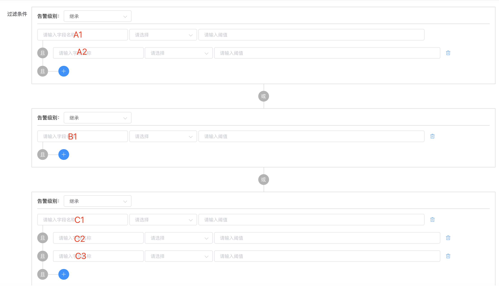

告警过滤是把从消费队列中取出的告警根据设定的条件进行过滤，如果符合条件要被过滤，则对应的告警将不会发出，否则告警将正常发送。告警过滤发生在消费告警、自动恢复之后，即进入主体告警逻辑之前对告警进行拦截处理，可以临时性屏蔽一些告警发送，而不用去修改业务代码。

::: warning 请注意
哮天犬不是大数据计算平台，不适合在告警未做任何条件预处理之前全部发到哮天犬做告警过滤。比如不适合把某个域名的访问日志全部告警到哮天犬，然后在哮天犬做告警过滤达到对某些特定的日志告警，应该在日志中心自动化告警这种大数据计算平台配置日志过滤条件，经过大数据计算平台预处理之后再发到哮天犬。

告警过滤适用于在服务爆发性异常、压测等特定场景想临时屏蔽某些告警的场景。
:::

## 过滤模式

过滤模式分为 `白名单` 和 `黑名单` 两种模式，即允许通过和禁止通过过滤的意思。

选择 `白名单` 模式时，告警只有 **满足** 过滤条件中配置的条件时，才能进行到下一步的告警流程处理，比如告警收敛、正常发送告警等等，如果不满足条件，则会根据 `未命中过滤` 中的选项进行处理。

选择 `黑名单` 模式时，告警 **不满足** 过滤条件时，才能进行到下一步的告警流程处理，比如告警收敛、正常发送告警等等，如果满足条件，则会根据 `未命中过滤` 中的选项进行处理。

## 未命中过滤

未命中过滤实际上应该是经过 `过滤模式` 和 `过滤条件` 处理之后得到的一种状态，在 `过滤模式` 中有说明：

**不满足白名单条件和满足黑名单条件的状态。**

所以实际上 `未命中过滤` 的表述不是很清晰，字面意思只能会意不满足白名单条件。关于这点，欢迎各位老师提建议换成更准确的描述。

如果选择 `直接入库`，表示此类告警保存到数据库中作为告警记录但不发送告警（如果在基本信息中选择了告警不入库存储，则此处不进行入库处理），如果选择 `丢弃告警`，表示此类告警不保存数据库直接丢弃，也不发送告警。

## 过滤条件

过滤条件是告警内容判断告警是否满足过滤条件的依据。告警条件使用的是最基本的逻辑运算单元，可以组合成 `(A1 && A2) || (B1) || (C1 && C2 && C3)` 逻辑运算，每一组 `()` 为一组且逻辑单元，每个且逻辑单元有一个告警级别配置，其中有五个选项：`通知`、`警告`、`错误`、`紧急`、`继承`，前面四个表示满足此逻辑单元条件时，会终止下面的条件继续判断，同时 **篡改** 告警内容中的告警级别 `level` 为选定的告警级别，如果选择 `继承`，表示不篡改。

  

告警条件字段一般以 `ctn.` 开头，使用方法与告警收敛的[收敛条件](./compress.html#收敛方式-条件收敛)一样，具体说明请参考：

- 字段请移步：[字段](./compress.html#条件收敛-字段) 
- 条件请移步：[条件](./compress.html#条件收敛-条件) 
- 阈值请移步：[阈值](./compress.html#条件收敛-阈值) 
- 逻辑运算单元请移步：[逻辑运算单元](./compress.html#条件收敛-逻辑运算单元) 
