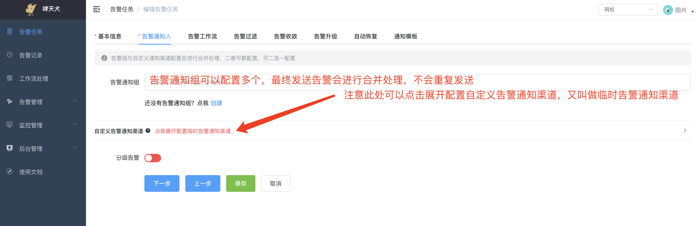

告警通知人即告警接收人，此处的人并不是只指具体某位/群老师，而是不同的通知渠道对应的接收人，比如知音楼工作通知接收人就是具体某位/群老师，知音楼群通知就是具体的某个群机器人。

告警通知人配置分为告警通知组和自定义临时通知渠道组合而成，可以自由组合，但除去Webhook通知以外，其他通知渠道/告警通知组至少要配置一个，且最终告警发送时会对告警通知组、临时通知渠道中的接收人进行合并处理。例如A、B告警通知组中短信告警接收人都有User1，那么最终User1并不会收到两条短信，而是一条。

  

## 告警通知组

告警通知组可以理解成下方自定义通知渠道的可复用通知人（联想可复用代码块、函数类库），建议能使用告警通知组的地方就尽可能使用告警通知组，然后一个业务场景、项目有多个告警任务时，可以直接关联同一个告警通知组，如果需要调整告警接收人，不需要一个一个告警任务修改。

## 自定义告警通知渠道

自定义告警通知渠道总共分为八种告警通知渠道：

- **钉钉工作通知**：即将下线，已不可使用；
- **知音楼工作通知**：告警直接发送到接收人知音楼客户端的 `企业助手` 中，无需特殊配置，正式员工都可使用，外包老师不支持；
- **邮件通知**：告警直接发送到接收人 `企业邮箱` 中，无需特殊配置，正式员工都可使用，外包老师不支持；
- **短信**：告警发送到接收人 `手机短信` 中，需要对应接收人在哮天犬完成手机号配置才可正常使用短信告警，具体配置方式请参考：[手机号配置及确认](../faq/cannot-receiver-sms-phone.html#手机号配置及确认)；
- **电话**：同短信一样，请参考短信渠道说明；
- **知音楼机器人**：告警发送到配置的知音楼机器人中，具体配置请参考：[怎么配置知音楼机器人（知音楼群）通知](../faq/how-to-config-yachgroup.html)；
- **钉钉机器人**：告警发送到配置的钉钉机器人中，因已不推荐使用钉钉，不建议继续使用该告警渠道，除非特殊场景需要，具体配置请参考：[怎么配置钉钉机器人（钉钉群）通知](../faq/how-to-config-dinggroup.html)；
- **WebHook**：该通知渠道实际上是将告警发送到其他系统，因可能配置无效，告警是否能触达存在不确定性，所以该通知渠道不允许单独使用，配置了WebHook的同时其他通知渠道或者告警通知组也至少需要配置一个，WebHook的使用方式请参考：[Webhook通知渠道怎么用](../faq/how-to-use-webhook.html)。

## 分级告警

如果你需要根据告警内容不同将告警发送给不同的通知人，可以参考分级告警的使用：[分级告警](./dispatcher.html)。
