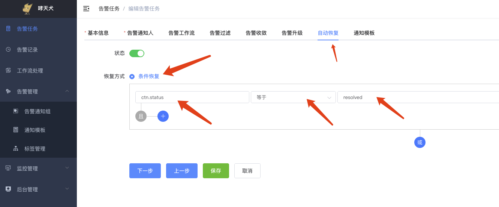
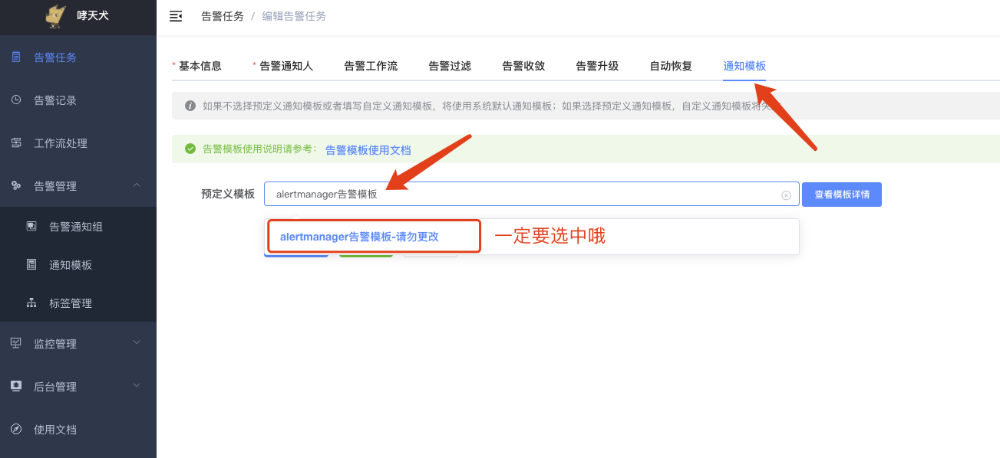
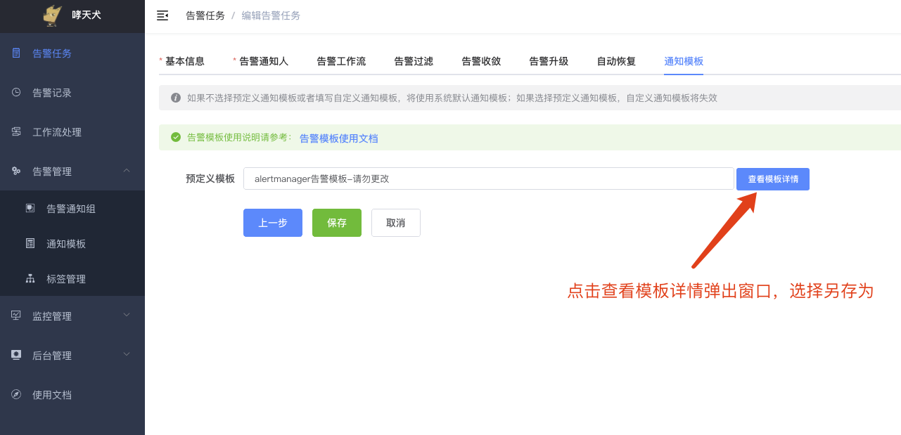
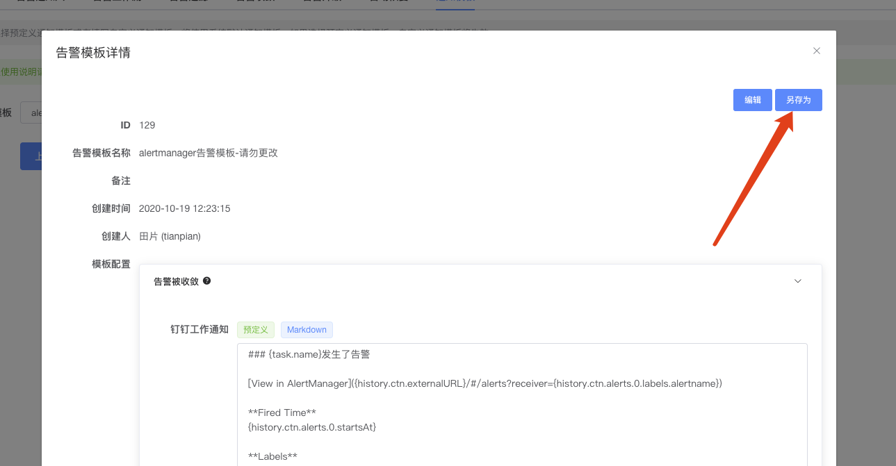
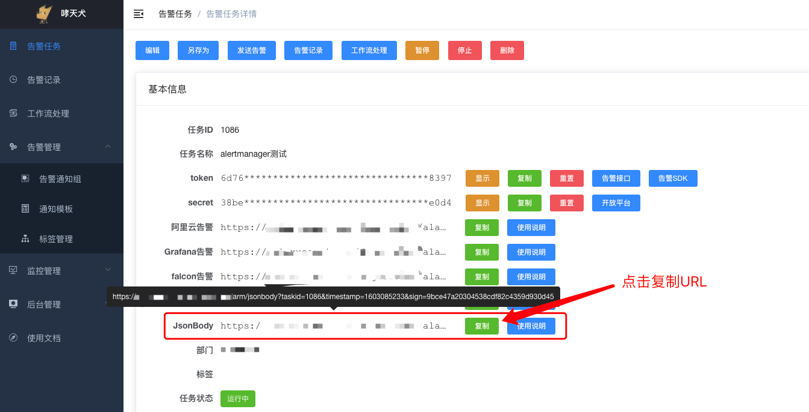
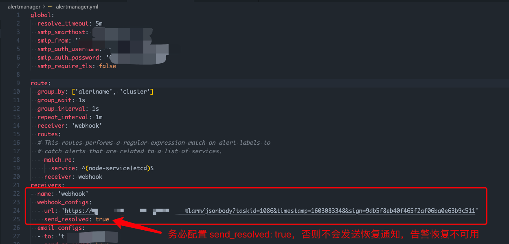
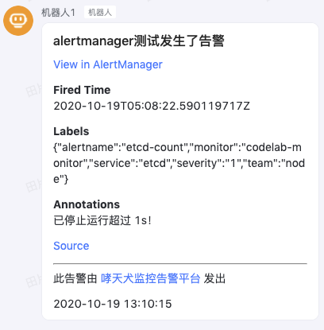
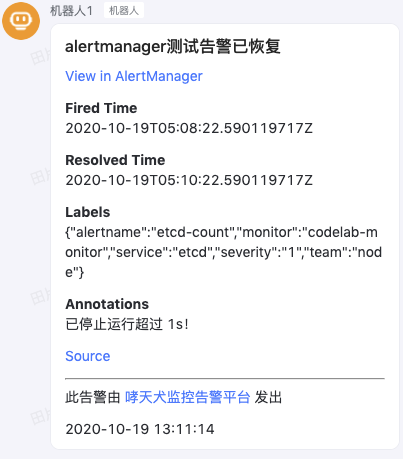

---
AlertManager告警接入
---

Prometheus是一个非常强大的监控工具，但本身不具备告警功能，告警功能主要通过 Grafana 或者 AlertManager 等工具来实现，Grafana的告警接入请参考：[Grafana告警接入](./grafana.md)。AlertManager的告警接入请参考本篇接入文档进行接入。

## Step1：创建哮天犬告警任务

前往哮天犬后台 [https://alarm-dog.domain.com](https://alarm-dog.domain.com)，在告警任务菜单页点击创建告警任务，基本信息、告警通知人等根据实际情况填写，自动恢复和通知模板需要特殊配置一下，否则发送出来的内容可读性非常差。

在自动恢复这里，开启自动恢复，并选择恢复方式为 `条件恢复`，然后字段填写 `ctn.status`，条件选择 `等于`，阈值填写 `resolved`。至此，自动恢复已配置完成。

  

接着切换到通知模板，然后搜索 `alertmanager告警模板`，选择该模板：

   

如果觉得默认模板不满意，可以选中之后，点另存为重新编辑，保存之后搜索另存为的模板名称即可：

  

  

有关告警模板的编辑，请参考：[告警模板](../advance-function/alarm-template.md)

## Step2：获取AlertManager告警的URL

告警任务创建完成之后，页面会自动跳转到告警任务详情页，在详情页，找到Grafana告警这一项，然后复制该URL以备使用。

  

## Step3：在AlertManager中配置webhook

编辑AlertManager的配置文件，默认路径为 `/etc/alertmanager/alertmanager.yml`，或者使用docker的自行修改对应挂载的文件，在对应的 `receivers` 中增加 `webhook_config` 的配置，且务必配置 `send_resolved: true`，否则无法发送恢复通知，告警恢复不可用。

  

## 实际效果

如果一旦有告警，会在哮天犬配置的任务中的各通知渠道发送告警，下面截图是告警发送到知音楼群的示例：

  

如果告警恢复，则会收到如下告警：

  

如果觉得发送的告警比较丑，想自己优化，请参考 [#Step1](#step1：创建哮天犬告警任务) 中的告警通知模板另存为的说明。
