---
阿里云告警接入
---

哮天犬提供了对阿里云告警的支持，阿里云原生的告警虽然很强大，但是只能将告警发送到钉钉、邮件、短信，且调整不太方便。为此，哮天犬使用阿里云告警的webhook回调方式对阿里云的告警进行分发，使告警可以发送到钉钉工作通知、钉钉群、知音楼工作通知、知音楼群、短信、电话、邮件等渠道，并且可以很方便的查看告警记录，可以使用哮天犬的告警收敛等一系列高级功能。下面讲一下详细步骤：

## Step1：创建哮天犬告警任务

前往哮天犬后台 [https://alarm-dog.domain.com](https://alarm-dog.domain.com)，在告警任务菜单页点击创建告警任务，基本信息、告警通知人等根据实际情况填写，自动恢复和通知模板需要特殊配置一下，否则发送出来的内容可读性非常差。

在自动恢复这里，开启自动恢复，并选择恢复方式为 `条件恢复`，然后字段填写 `ctn.alertState`，条件选择 `等于`，阈值填写 `OK`。至此，自动恢复已配置完成。

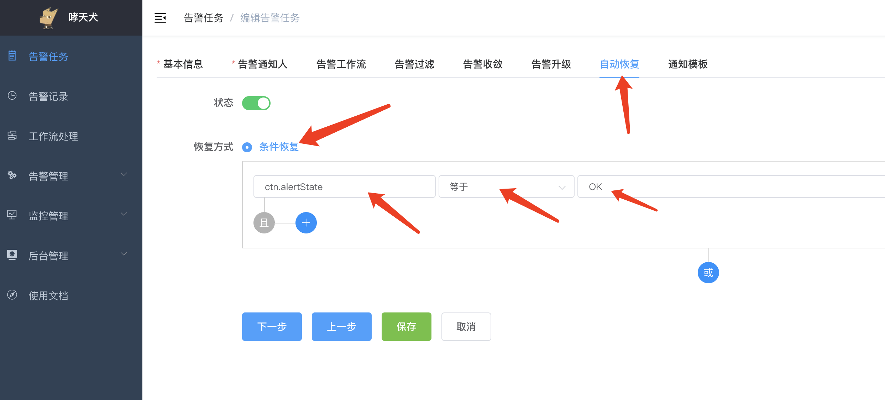  

接着切换到通知模板，然后搜索 `阿里云告警`，选择该模板：

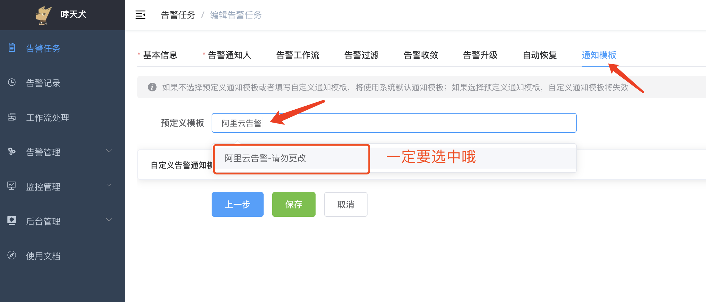  

如果觉得默认模板不满意，可以选中之后，点另存为重新编辑，保存之后搜索另存为的模板名称即可：

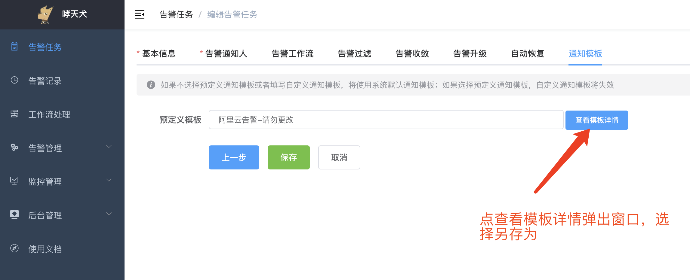  

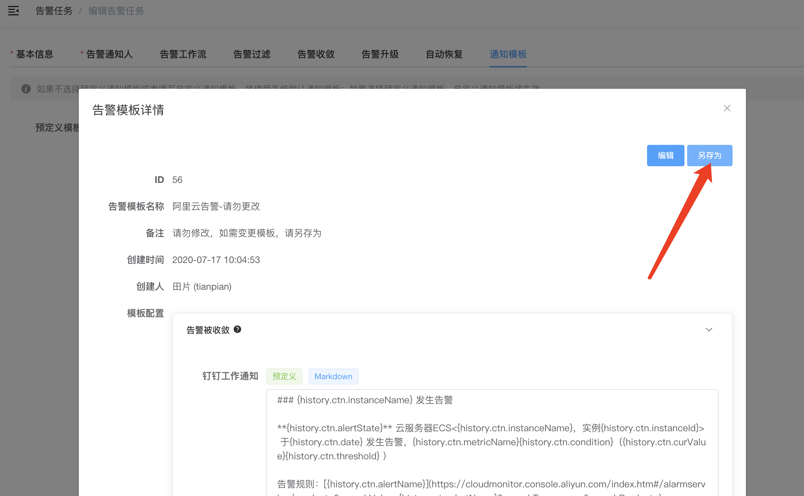  

有关告警模板的编辑，请参考：[告警模板](../advance-function/alarm-template.md)

## Step2：获取阿里云告警的URL

告警任务创建完成之后，页面会自动跳转到告警任务详情页，在详情页，找到阿里云告警这一项，然后复制该URL以备使用。

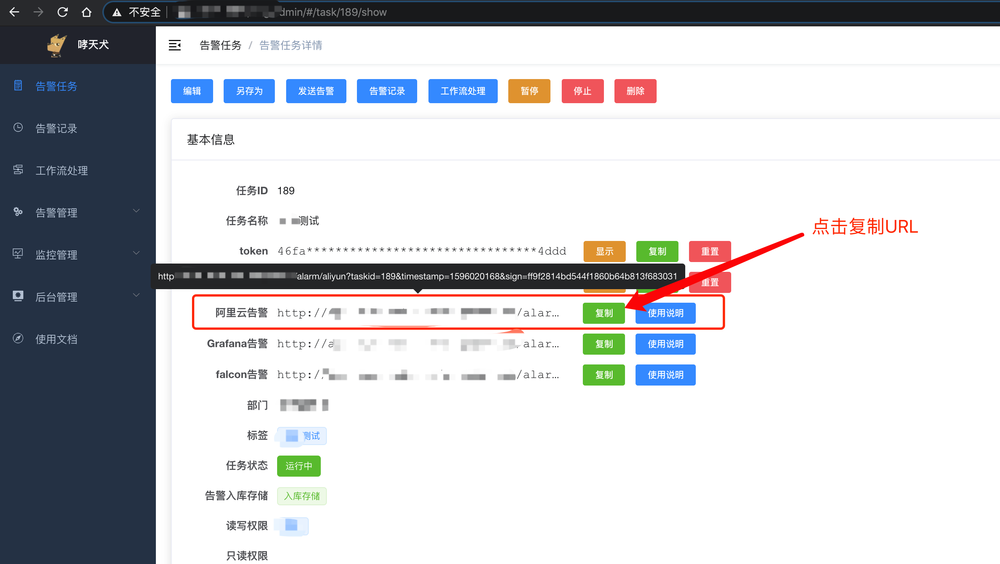  

## Step3：配置报警规则

首先在阿里云的控制台找到对应服务器的报警规则设置按钮，点击进入。该按钮可能会在多个地方出现，以下截图展示的只是其中一种方式：

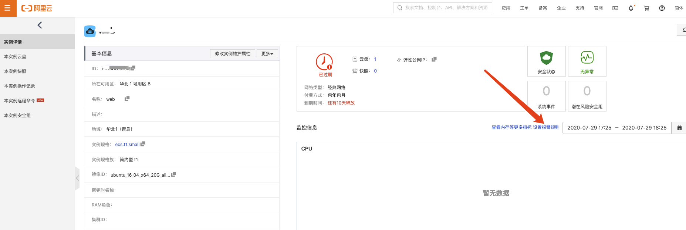  

进一步找到告警规则创建或者修改已存在的报警规则：

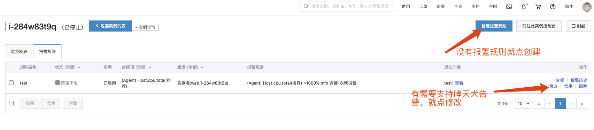  

## Step4：配置告警通知webhook

哮天犬只涉及修改第三步的通知方式，其他的配置请根据实际情况配置，不影响哮天犬告警。

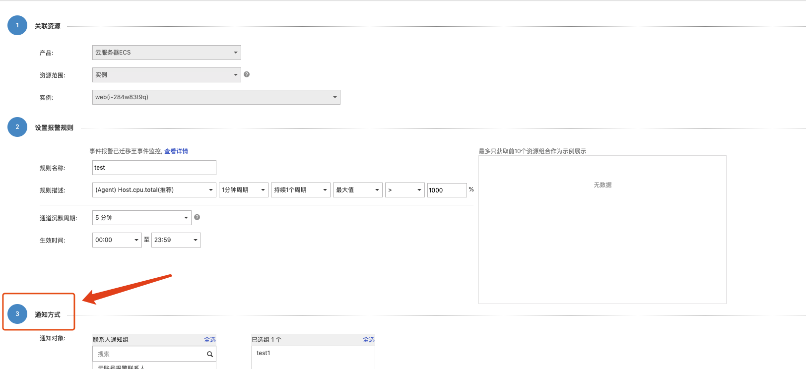  

由于红框中的通知方式无法删除，只能保留阿里云自带的告警通知，此处请根据实际情况妥善处理。

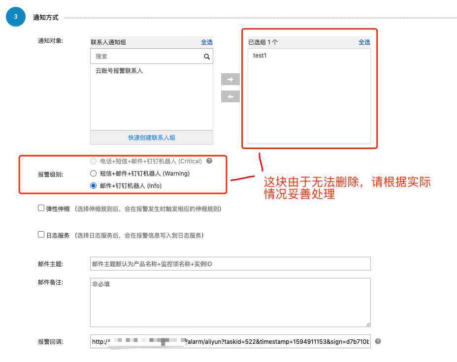  

在报警回调中填写从哮天犬复制的阿里云告警的URL，然后确认保存。

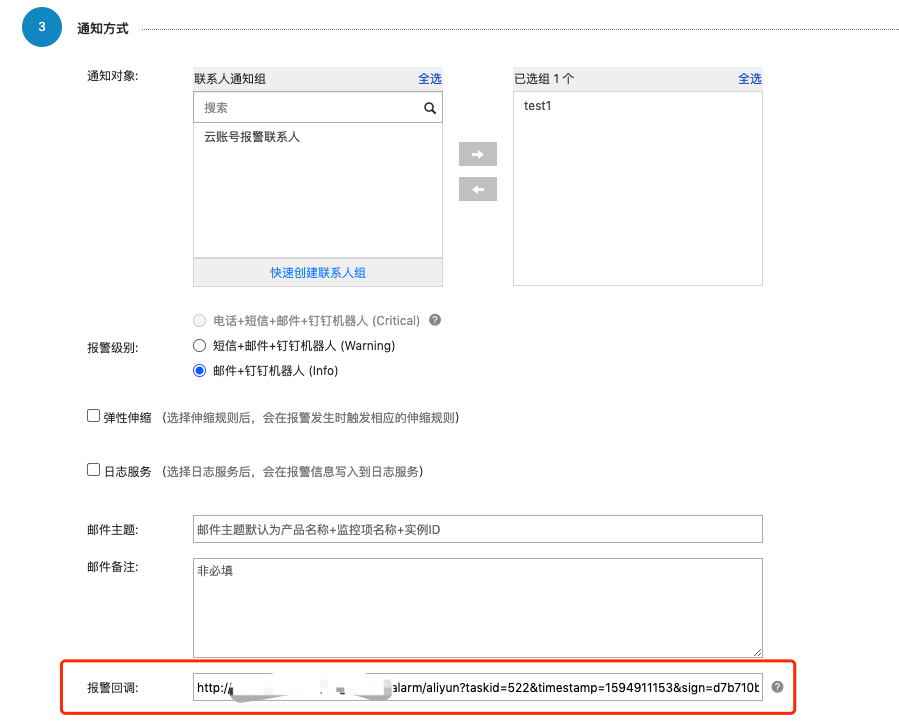  

至此阿里云告警通知配置全部完成。

## 实际效果

如果一旦有告警，会在哮天犬配置的任务中的各通知渠道发送告警，下面截图是告警发送到知音楼群的示例：

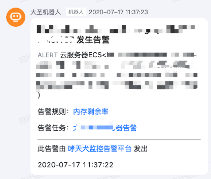  

如果觉得发送的告警比较丑，想自己优化，请参考 [#Step1](#step1：创建哮天犬告警任务) 中的告警通知模板另存为的说明。

## 备注说明

由于阿里云webhook回调发送给哮天犬的参数有限，无法做到100%还原到跟阿里云直接发送到钉钉的一样，请谅解。
