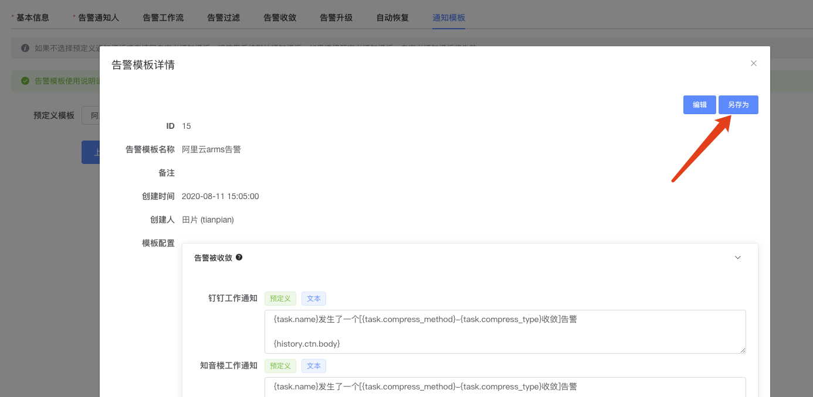

---
阿里云Arms告警接入
---

哮天犬也提供了对阿里云Arms告警的支持，阿里云Arms是一个综合性的告警平台，功能强大，提供了邮件、短信、钉钉群和webhook的通知渠道，但是不熟悉好未来业务场景，没法做到将告警很精确的投递到应该投递的地方。哮天犬通过webhook方式接入arms，对告警进行进一步分发，还可以根据告警内容做一些告警收敛、工作流等高级功能，做到无缝与Arms衔接。

## Step1：创建哮天犬告警任务

前往哮天犬后台 [https://alarm-dog.domain.com](https://alarm-dog.domain.com)，在告警任务菜单页点击创建告警任务，基本信息、告警通知人等根据实际情况填写，通知模板需要特殊配置一下，否则发送出来的内容可读性非常差。

接着切换到通知模板，然后搜索 `阿里云arms告警`，选择该模板：

  

如果觉得默认模板不满意，可以选中之后，点另存为重新编辑，保存之后搜索另存为的模板名称即可：

  

  

有关告警模板的编辑，请参考：[告警模板](../advance-function/alarm-template.md)

## Step2：获取阿里云Arms告警的URL

告警任务创建完成之后，页面会自动跳转到告警任务详情页，在详情页，找到阿里云arms这一项，然后复制该URL以备使用。

  

## Step3：新建Webhook

在Arms控制台中找到报警管理菜单，点击展开后找到联系人管理菜单，点击进入后，点击右上角 `新建webhook` 按钮创建一个webhook联系人：

  

Webhook名称根据情况填写，请求方式必须选择Post，后面的URL填写之前在哮天犬复制的阿里云arms告警的URL，然后Body填写 `$content`（此文档编写时阿里云Arms有bug，Body必须填写 `"$content"`）

  

在联系人管理也找到联系人组的tab，然后找到或者新建一个联系人组，然后将刚刚创建的webhook关联到联系人组：

  

## Step4：配置告警规则

创建或者编辑告警规则时，如下图所示，勾选Webhook通知，将刚刚创建的联系人组关联进来，然后保存告警规则观察告警情况：

  

## 实际效果

如果一旦有告警，会在哮天犬配置的任务中的各通知渠道发送告警，下面截图是告警发送到知音楼群的示例：

  

如果觉得发送的告警比较丑，想自己优化，请参考 [#Step1](#step1：创建哮天犬告警任务) 中的告警通知模板另存为的说明。
