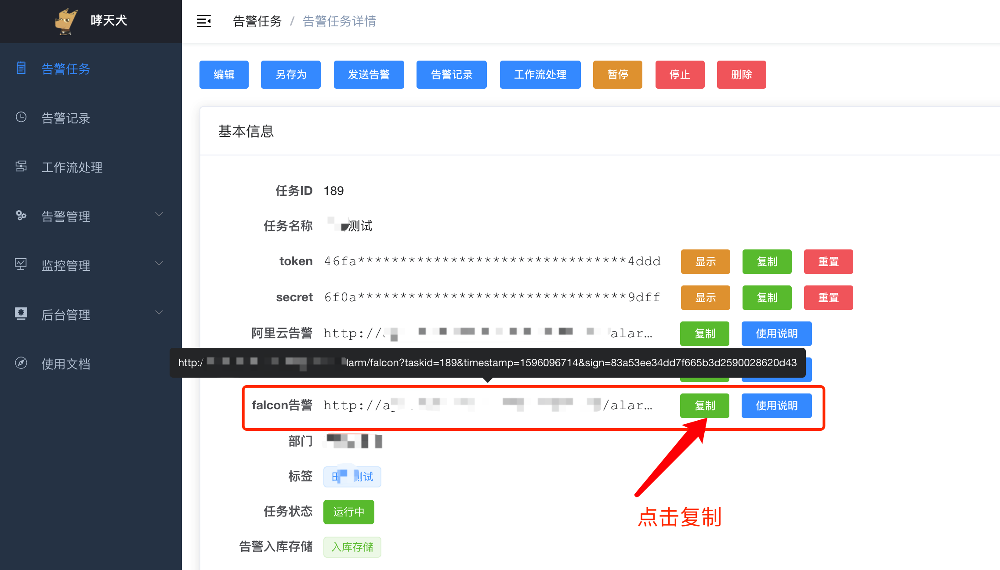
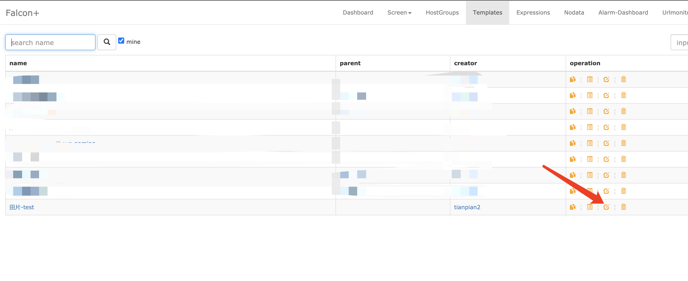
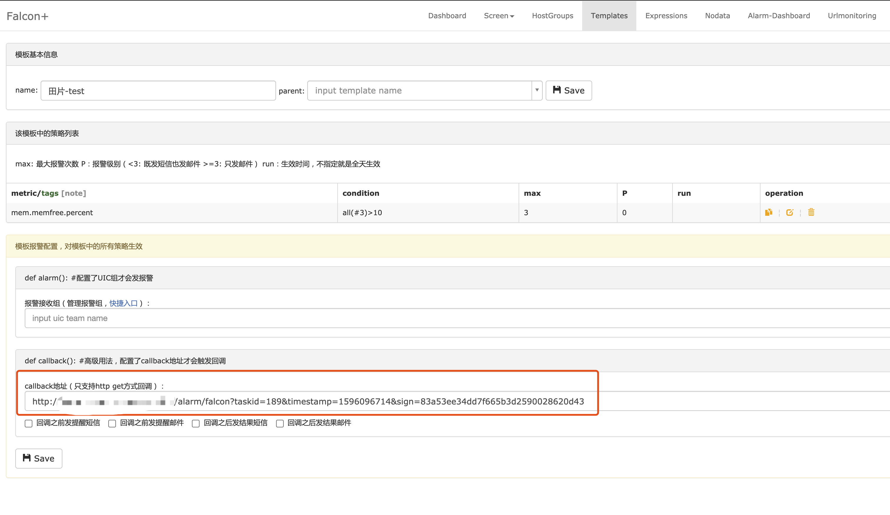

---
OpenFalcon告警接入
---

OpenFalcon因报警出来的数据指标很少，这里只做简要介绍如何配置。

## Step1: 创建告警任务

前往哮天犬后台创建告警任务，所有信息根据自己实际情况配置，创建成功之后，跳转到任务详情页，复制falcon告警这一项后面的URL以备使用：

  

## Step2：配置OpenFalcon的Templates

登录到OpenFalcon的后台，然后找到 `Templates` 选项卡，然后编辑对应的告警模板：

  

然后找到 `callback地址` 这一项，填写刚刚复制的falcon告警的URL，点击保存即可。

  

如果觉得发送的告警内容很丑，可以配置告警模板，具体请参考：[告警模板](../advance-function/alarm-template.md)。
