---
Grafana告警接入
---

哮天犬提供了对Grafana告警的支持，Grafana原生的告警虽然很强大，但是一般我们使用的都是钉钉告警、邮件告警，如果要实现其他渠道的告警，需要配合队列来实现，成本特别高，同时邮件告警还需要在Grafana的服务器上事先配置好了邮箱smtp服务，而这个对于普通研发来说，是很难申请或者其他渠道获得的。为此，哮天犬使用Grafana的钉钉告警，将Grafana的钉钉告警推送到哮天犬，然后哮天犬将告警再进行分发，使告警可以发送到钉钉工作通知、钉钉群、知音楼工作通知、知音楼群、短信、电话、邮件等渠道，并且可以很方便的查看告警记录，可以使用哮天犬的告警收敛等一系列高级功能。下面讲一下详细步骤：

## Step1：创建哮天犬告警任务

前往哮天犬后台 [https://alarm-dog.domain.com](https://alarm-dog.domain.com)，在告警任务菜单页点击创建告警任务，基本信息、告警通知人等根据实际情况填写，自动恢复和通知模板需要特殊配置一下，否则发送出来的内容可读性非常差。

在自动恢复这里，开启自动恢复，并选择恢复方式为 `条件恢复`，然后字段填写 `ctn.title`，条件选择 `包含`，阈值填写 `[OK]`。至此，自动恢复已配置完成。

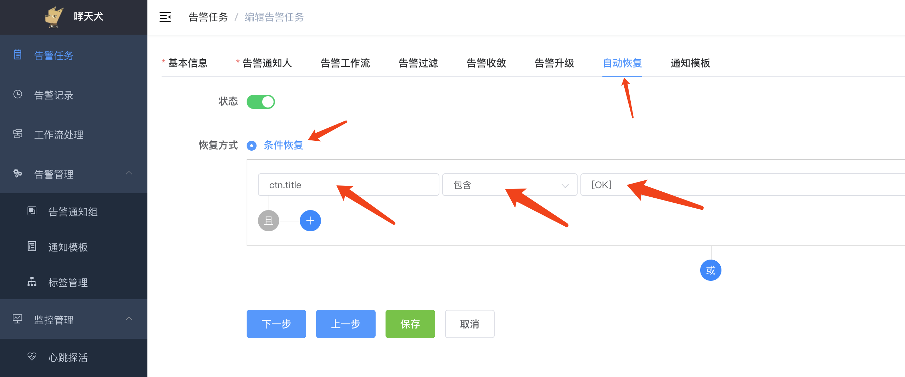  

接着切换到通知模板，然后搜索 `grafana告警`，选择该模板：

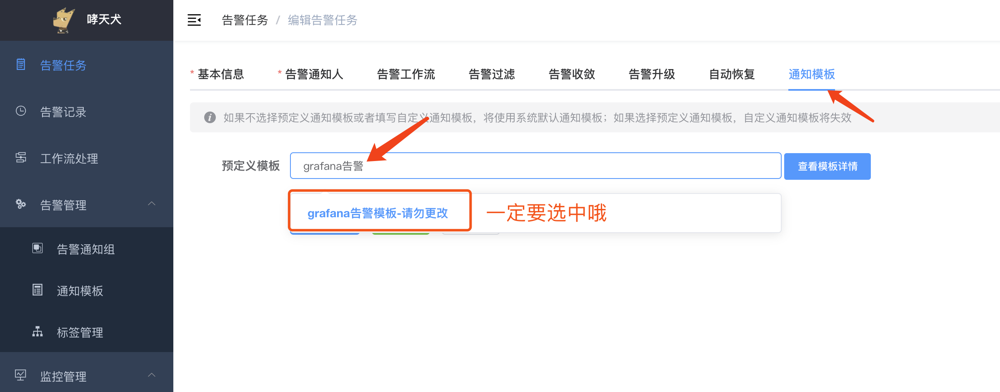  

如果觉得默认模板不满意，可以选中之后，点另存为重新编辑，保存之后搜索另存为的模板名称即可：

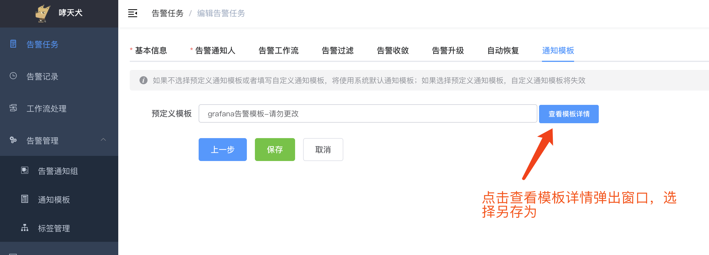  

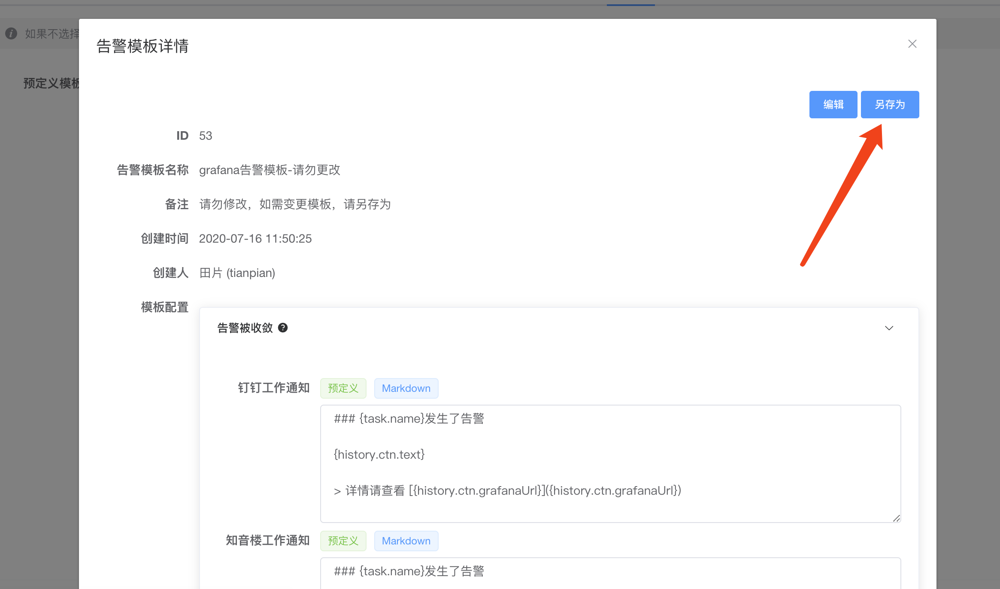  

有关告警模板的编辑，请参考：[告警模板](../advance-function/alarm-template.md)

## Step2：获取Grafana告警的URL

告警任务创建完成之后，页面会自动跳转到告警任务详情页，在详情页，找到Grafana告警这一项，然后复制该URL以备使用。

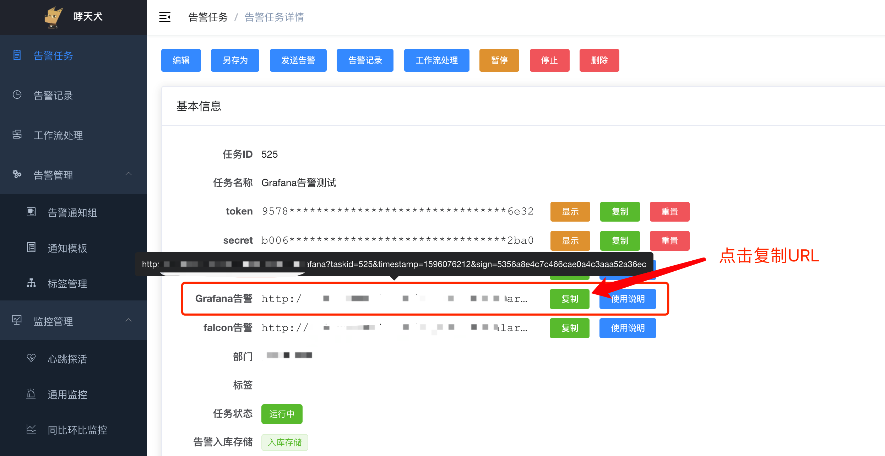  

## Step3：前往Grafana配置通知渠道

登录Grafana之后，在左侧菜单找到 `Alerting菜单（警铃符号）`，然后点击 `Notification Channels` 菜单，进入到通知渠道配置：

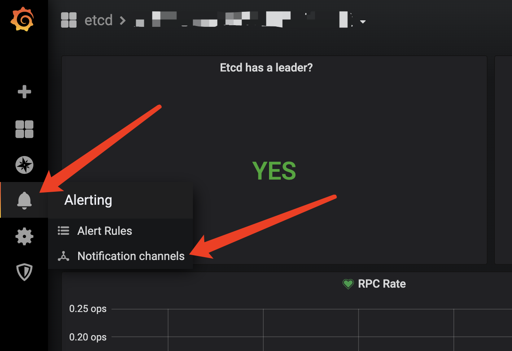  

点击左上角 `New Channel` 菜单，进入到通知渠道创建页面，`Type` 选择 `DingDing`，`Url` 填写刚刚复制的Grafana告警的URL：

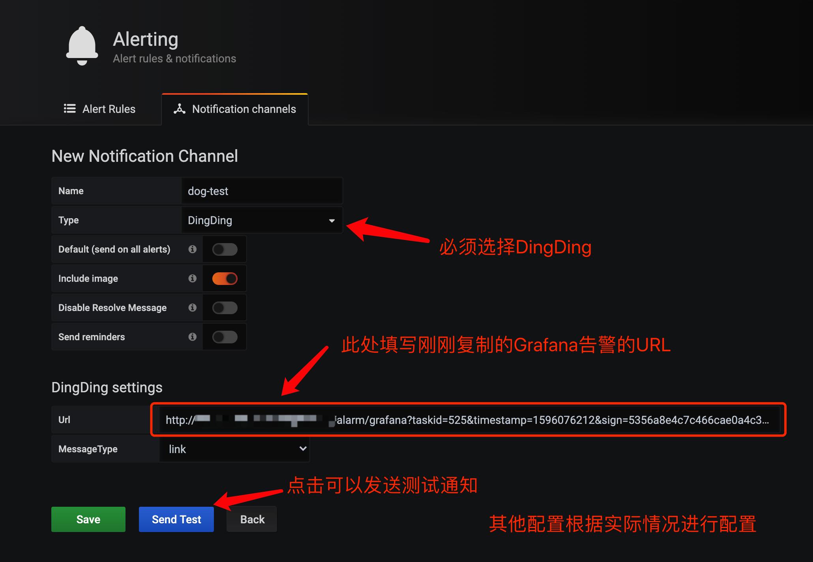

按要求配置好之后，可以点 `Send Test` 测试是否能收到测试告警，下面是知音楼机器人（知音楼群）收到的告警：

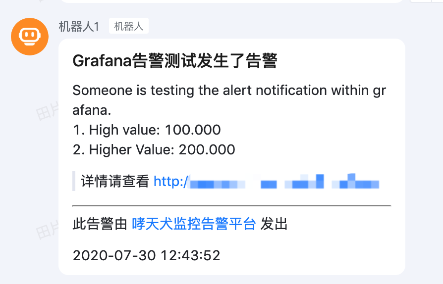  

## Step4：配置告警

进入到要配置告警的Dashboard，然后找到要配置的面板，点击面板名称，然后点击 `Edit`，进入到编辑页面：

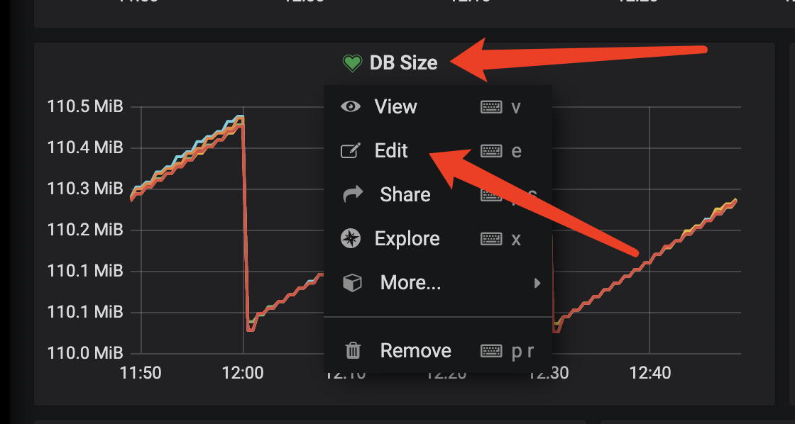  

切换到 `Alert` 选项卡，根据实际需求配置告警规则，然后在 `Send to` 那一项那里填写刚刚的通知渠道：

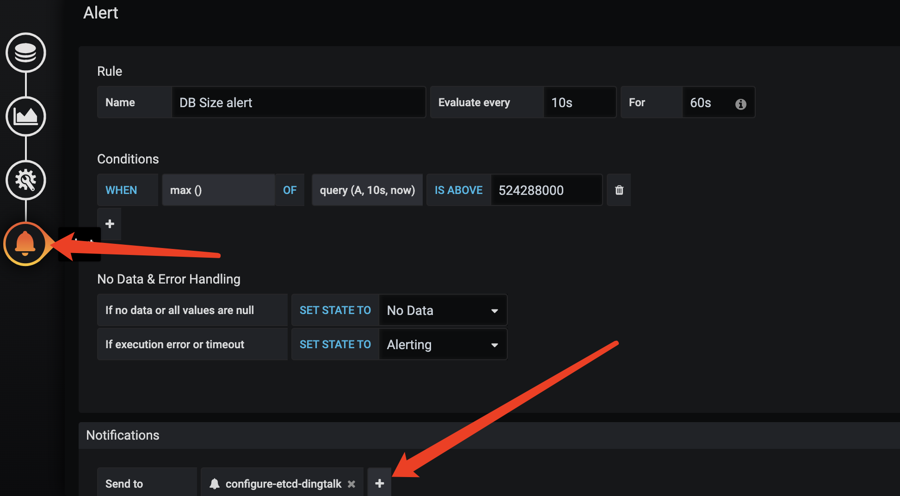  

然后点击保存即可，支持Grafana的告警全部配置完成。

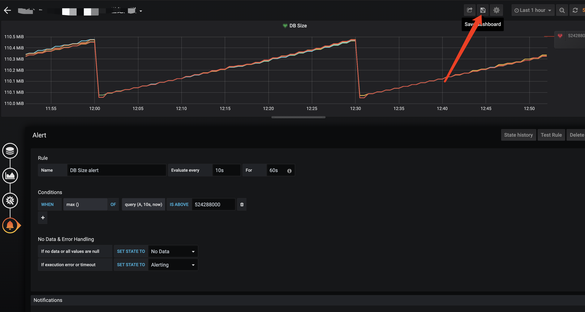  

## 实际效果

如果一旦有告警，会在哮天犬配置的任务中的各通知渠道发送告警，下面截图是告警发送到知音楼群的示例：

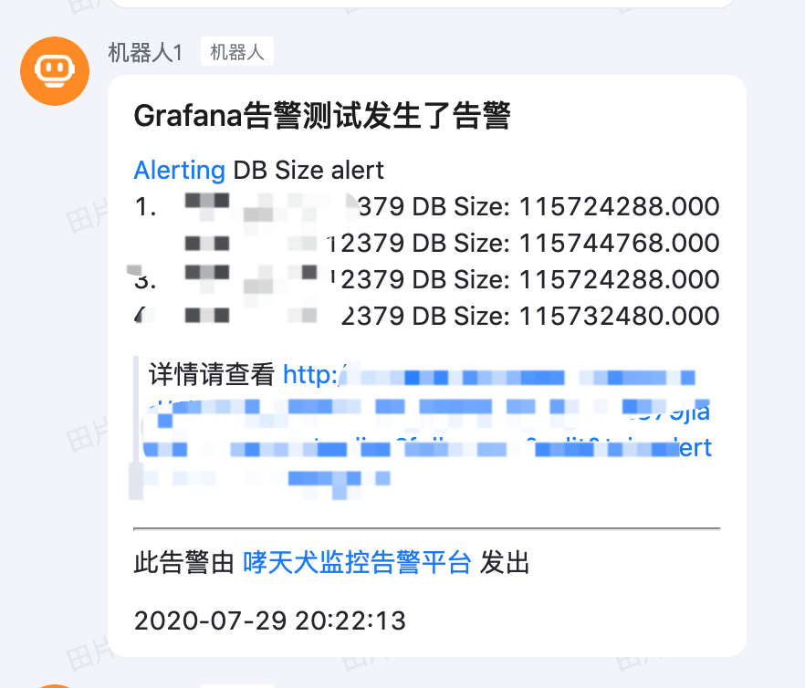  

如果告警恢复，则会收到如下告警：

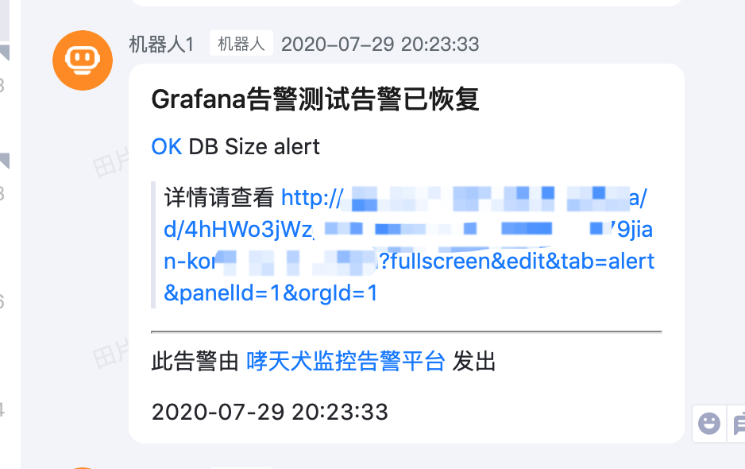  

如果觉得发送的告警比较丑，想自己优化，请参考 [#Step1](#step1：创建哮天犬告警任务) 中的告警通知模板另存为的说明。
