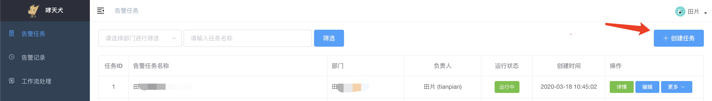
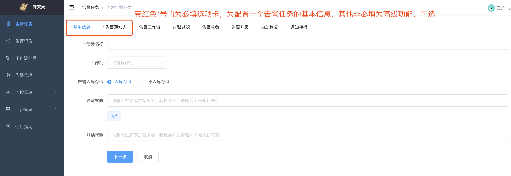
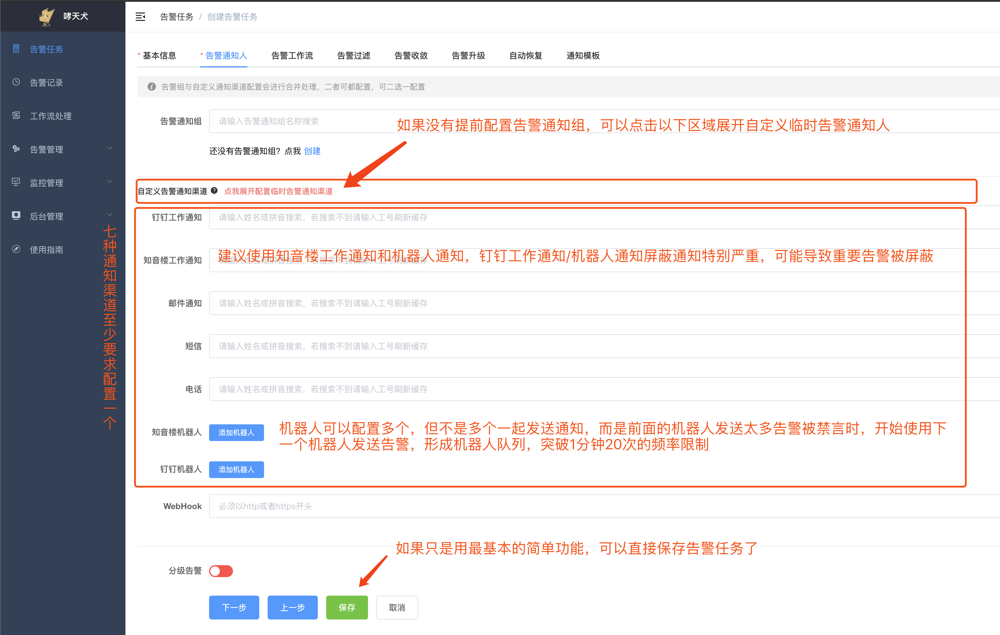
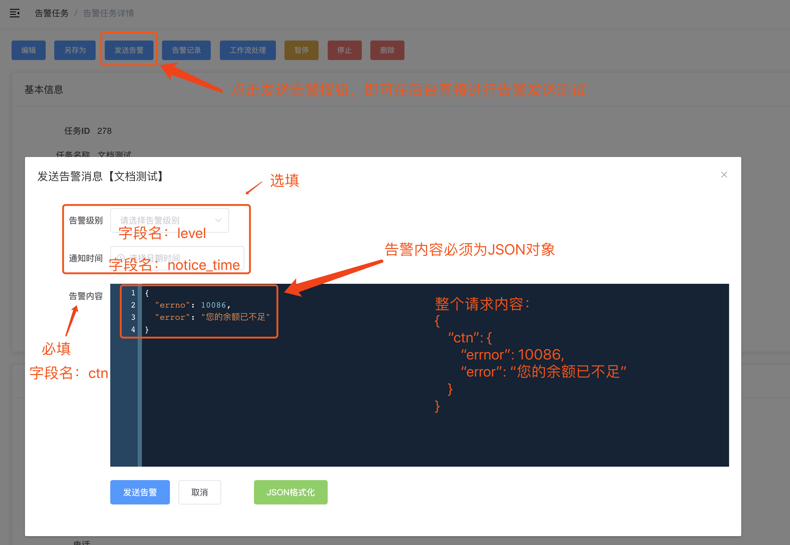
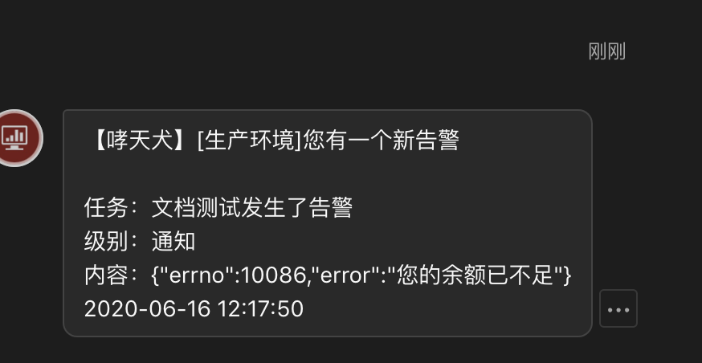
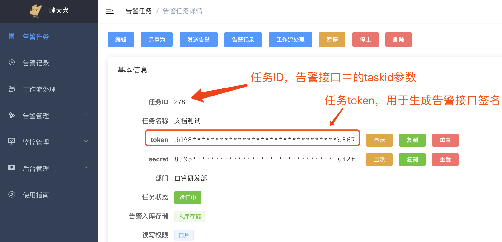

## Step1: 登录后台

访问哮天犬后台：[https://alarm-dog.domain.com](https://alarm-dog.domain.com)，使用钉钉/知音楼扫码或者SSO单点登录或者邮箱登录到哮天犬平台


## Step2: 创建任务

点击左侧告警任务菜单，然后点击右上角创建任务按钮进入任务创建页。

  

进入任务创建页，注意只有基本信息和告警通知人为必填模块，其他模块选填，建议您通过后面介绍了解高级功能之后能合理运用它们提高告警效率。填写好告警任务名称、选择部门，然后点击选项卡告警通知人进入告警通知人配置。

  

如果没有提前配置告警通知组，可以点击图中所示区域展开自定义通知渠道配置配置临时通知人。告警通知组或者七大主要通知渠道至少填写一个，知音楼、钉钉机器人可以配置多个机器人，但并不是发送告警给这些所有的机器人，而是前面的机器人发送太多告警被禁言之后，后面的告警机器人作为“替补”，突破单一告警机器人频率限制。

由于钉钉工作通知、钉钉机器人通知频率限制比较严重，建议使用知音楼工作通知、知音楼机器人通知。

  

点击保存之后，进入任务详情页。


## Step3：在线告警测试

哮天犬后台可直接发送测试告警，以测试告警效果。

  

安装图中所示输入告警内容之后，能收到如下告警：

  


## Step4：告警接口测试

告警接口请参考 [告警接口API](alarm-api.md)

首先，我们在任务详情页找到任务ID和token，如下图所示：

  

根据告警任务ID和token，我们得到签名信息：

```
taskid = 278
token = "dd98e713eee47c65db528e6e0e3c08bc1c7eb867"
timestamp = 1592285175
sign = md5(taskid + "&" + timestamp + token)
    = md5("278" + "&" + "1592285175" + "dd98e713eee47c65db528e6e0e3c08bc1c7eb867") 
    = md5("278&1592285175dd98e713eee47c65db528e6e0e3c08bc1c7eb867")
    = "fe986dbec55cae7e0271195cc909ba40"
```

然后我们测试告警：

```bash
curl -X POST 'https://alarm-dog-service.domain.com/alarm/report' \
-H 'Content-Type: application/json' \
-d '{
	"taskid": 278,
    "timestamp": 1592285175,
    "sign": "fe986dbec55cae7e0271195cc909ba40",
    "ctn": {
        "errno": 10086,
        "error": "您的余额已不足"
    }
}'
```

得到响应信息：

```json
{
  "data": {
    "uuid": "e1b32a26-db8d-4fed-9695-a7152c07a240",
    "report_time": "2020-06-16 13:29:56"
  },
  "msg": "success",
  "code": 0
}
```

证明我们告警已发送成功，同时会在配置的通知渠道收到告警。
