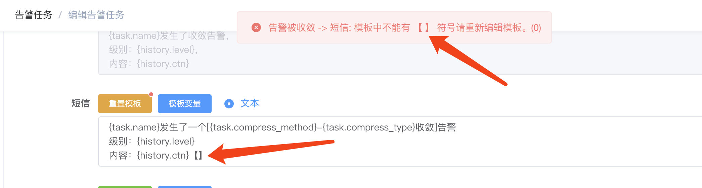
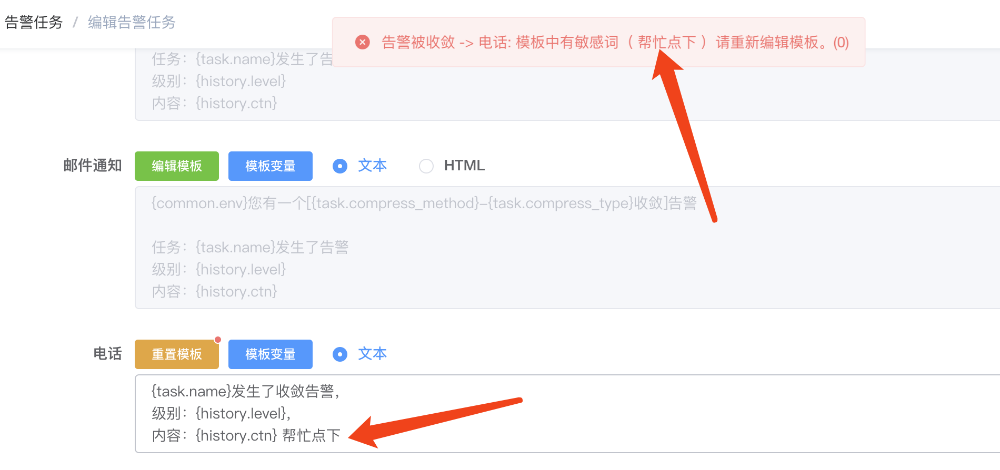
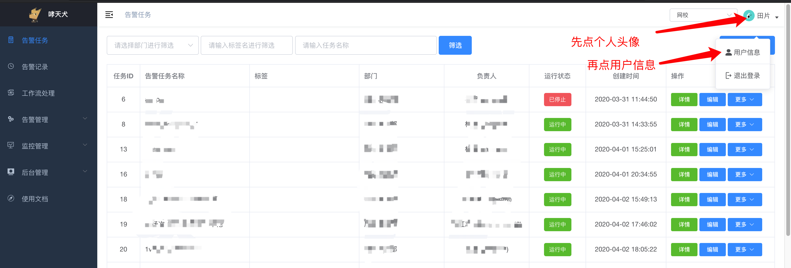
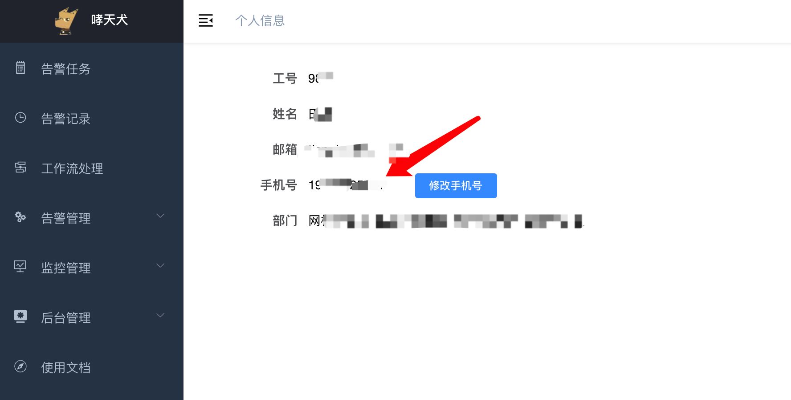

# 收不到短信和电话告警通知

如果您配置了短信、电话通知，但是收不到，请根据下面步骤逐一排查：

## 确认其他人是否收到告警

先跟其他同事确认一下他们是否收到短信或者电话通知，如果都没有收到，则有三种情况：

1. 都没有配置手机号；
2. 可能部分或者都配置有手机号，但是手机号配置错误；
3. 告警内容过长或者包含敏感词被拦截；

如果有部分同事收到，则可能有以下两种情况：

1. 部分老师没有配置手机号；
2. 手机号填写错误；

手机号配置或者核对手机号是否正确，请参考下方 [手机号配置及确认](#手机号配置及确认)；短信包含的敏感词目前已知的有：

1. 【
2. 】

目前哮天犬后台编辑短信模板会检测模板中是否包含【】符号，但是告警发送时进行模板变量替换之后也有可能包含【】符号，请不要在告警内容中使用【】符号，避免发送短信失败。

  

电话包含的敏感词比较多，不做枚举，目前哮天犬后台编辑电话模板时会做检测，如果包含敏感词，则会拦截提醒，但是告警发送时进行模板变量替换可能包含敏感词，请不要在告警内容里面包含特别敏感词。

  

告警内容过长会被自动截断发出，为了不影响接收告警的体验，请在电话、短信告警模板配置时，不要包含太多信息，精简能知道大概异常就好，更详细的告警信息可以配合邮件、知音楼、钉钉等渠道发送。

## 手机号配置及确认

在哮天犬后台右上角点击个人头像，然后再点击用户信息，进入到个人信息页：

  

找到手机号这一行，如果手机号为空，则完善即可，如果手机号不对，请务必修改为正确的，否则因手机号错误将重要告警信息发送给陌生人造成信息泄露，将由设置该手机号的人承担责任：

  

点击 `修改手机号` 即可修改手机号，了解修改手机号之后的风险之后，点 `我知道了`，然后输入自己的手机号，点击 `确定` 即可修改完成。

## 我可以替别人配置手机号吗？

不可以。一是涉及安全问题，二是涉及权限问题，请理解。如果涉及其他人手机号未配置，请联系对应老师在哮天犬后台完善手机号配置。
