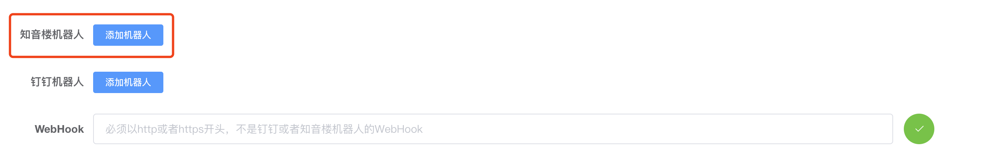
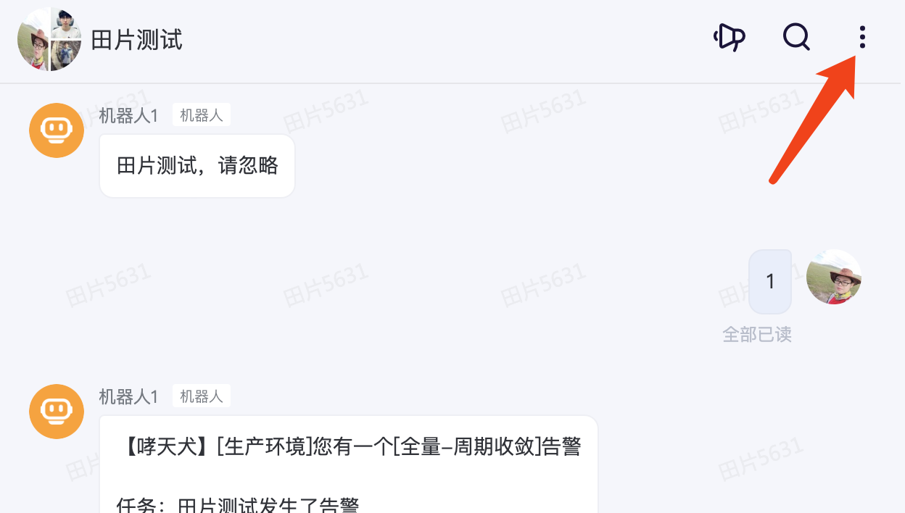
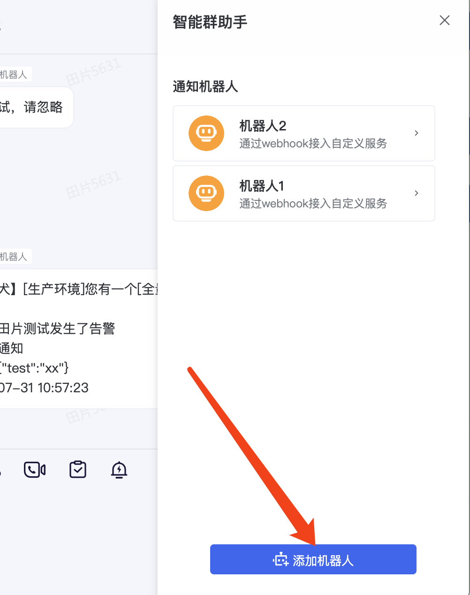
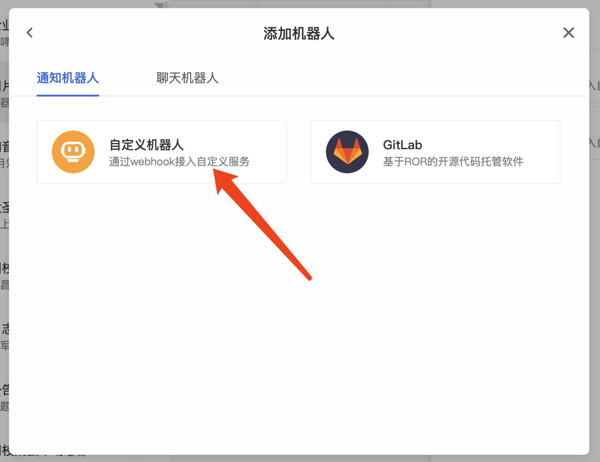
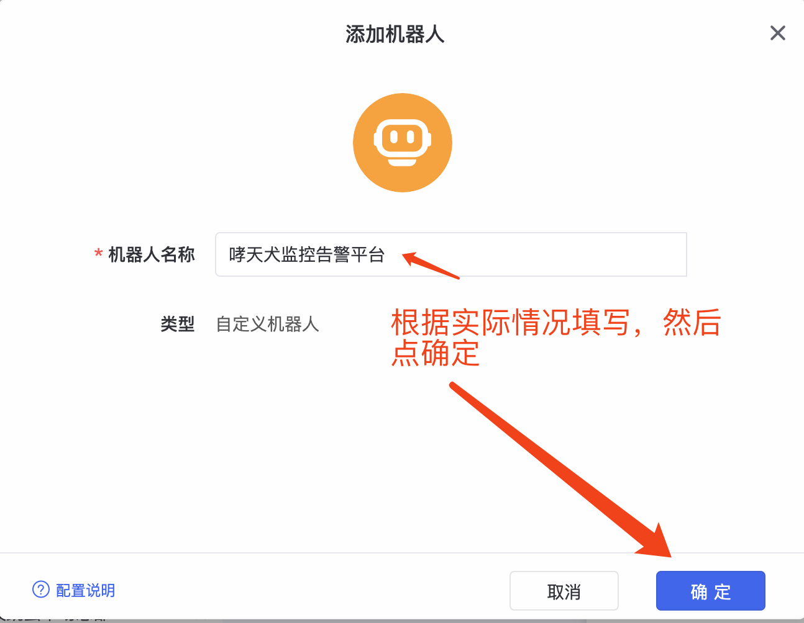
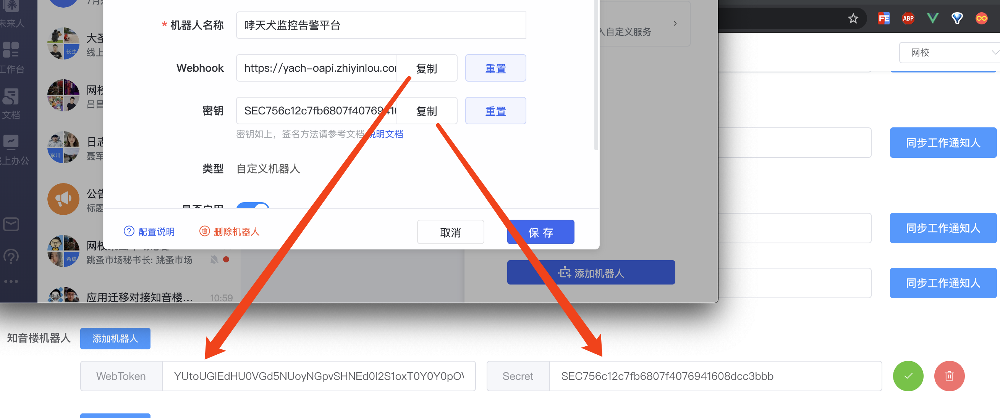
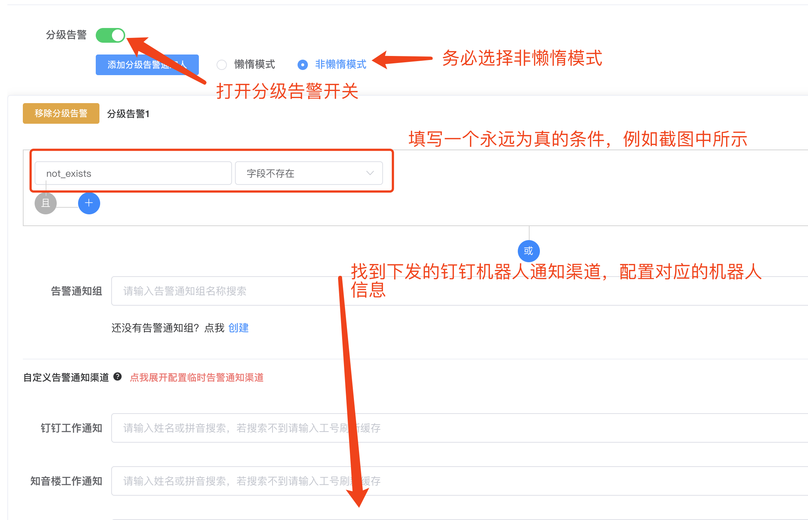

# 怎么配置知音楼机器人（知音楼群）通知

在创建告警任务或者告警通知组时，您可能会遇到要配置知音楼机器人（知音楼群）的告警通知，例如下面这样：

  

首先点击添加机器人，页面会出现 `WebToken` 和 `Secret` 两个配置，如果下图所示：

  

下面讲解如何配置知音楼机器人。

## 知音楼机器人配置

进入到知音楼，找一个群，没有则创建，然后点击群右上角群设置，点击智能群助手展开机器人配置：

   

点击添加机器人创建按钮：

  

选择自定义机器人：

  

然后点添加，机器人名称自定义，根据实际情况填写，例如 `哮天犬监控告警平台`

  

点击确定之后，机器人已经创建好了，然后把 `Webhook` 复制到浏览器的 `Webhook` 中，密钥复制到 `Secret` 中：

  

至此，一个机器人就配置好了，下面我们可以测试一下我们的配置是否正确，点击绿色的测试按钮，如果成功，机器人会发送一条测试通知，如果失败，浏览器端会提示具体错误：

  

测试成功，机器人会收到如下通知：

  
 
至此，一个机器人的配置及测试全部完成。

## 多个机器人的配置

如果你需要配置多个机器人，只需要点击添加机器人按钮创建多个机器人配置项，然后重复上面的步骤重复 [知音楼机器人配置](#知音楼机器人配置) 创建多个机器人，一个知音楼群可以配置最多10个自定义机器人。

## 为什么要配置多个机器人

知音楼官方对单个机器人进行了限制，每个机器人一分钟最多允许发送20个通知，如果超过则会限流，甚至禁言10分钟。为了减少这种事情发生，哮天犬支持配置多个机器人，这多个机器人并不是说发送通知时给这些机器人一起发送，而是优先第一个发送，当第一个机器人一分钟发送超过了19次，则进入 `sleep` 状态，使用下一个机器人发送，依次类推，如果配置10个机器人，则一分钟最多可以接收 19*10 = 190 条告警，较之前多10倍，这样就从侧面增加了群接收告警的能力。

## 怎样能让告警同时给多个群发送

由于前期设计未考虑这种情况，所以这种场景原则上是不支持的，但是可以利用 `分级告警` 功能去实现这种功能，下图是钉钉机器人的示例，知音楼机器人一样的。

  

按照上面截图中所示进行配置，即可实现告警通知发给多个机器人，如果需要配置更多个，重复上面的分级告警即可，添加多个分级条件组。

## 为什么收不到告警通知

1. 检查知音楼机器人配置是否正确，可以按照 [知音楼机器人配置](#知音楼机器人配置) 中的机器人测试来检查，如果存在问题，请修改，最多20s即可生效；
2. 检查知音楼机器人是不是短时间已发送大量告警通知，查看群中1分钟内机器人发送的告警的数量是否超过 `N * 19` ，其中 `N` 为在哮天犬配置的机器人的个数。
