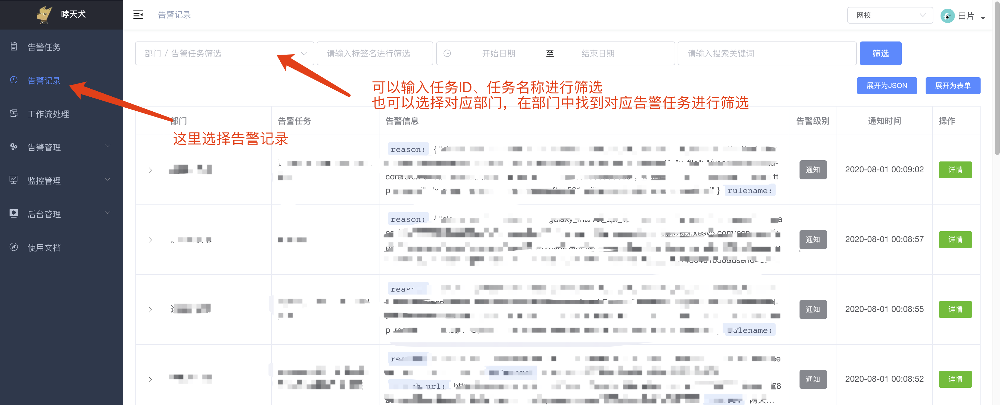
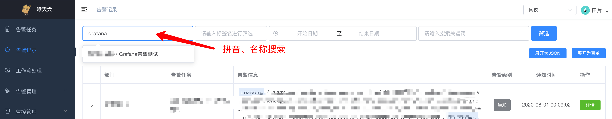
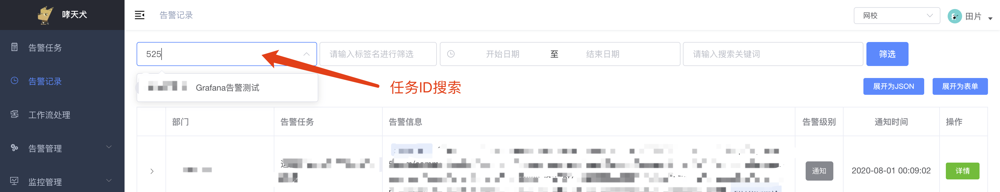
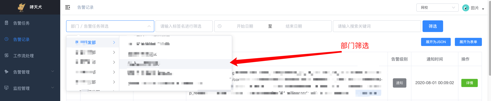
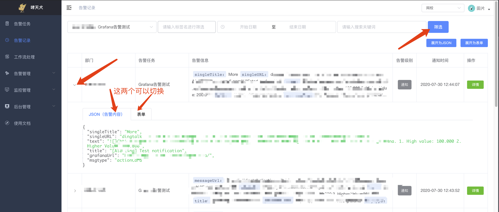

# 怎么找到告警内容

通过日志中心自动化告警接入到哮天犬的，如何找到告警内容呢？

无论是哪种方式接入到哮天犬，只要选择了告警入库存储（默认即选择的告警入库存储），都可以在告警记录里面找到告警内容。


## Step1：登录哮天犬，找到告警记录

首先，登录到哮天犬后台：[https://alarm-dog.domain.com](https://alarm-dog.domain.com)，然后点击左侧菜单告警记录，然后在 `部门 / 告警任务筛选` 输入框中搜索：

  


## Step2：搜索告警任务

在输入框中输入任务ID、任务名称关键词进行搜索：

  

  

  


## Step3：查看告警内容详情

筛选后，点击表格左侧按钮展开告警记录详情：

  

截图中的JSON即是告警接口中的 `ctn` 字段，我们可以把上面截图中的告警内容理解成下面告警接口中的 `ctn` 字段的值：

```shell
curl -X POST 'https://alarm-dog-service.domain.com/alarm/report' \
    -H 'Content-Type: application/json' \
    -d '{
        "taskid": 123,
        "timestamp": 1596212375,
        "sign": "xxx",
        "ctn": {
            "singleTitle": "More",
            "singleURL": "dingtalk://dingtalkclient/page/link?pc_slide=false&url=http%3A%2F%2F%2F",
            "text": "\n\nSomeone is testing the alert notification within grafana.\n 1. High value: 100.000\n 2. Higher Value: 200.000",
            "title": "[Alerting] Test notification",
            "grafanaUrl": "http://xxx/",
            "msgtype": "actionCard"
        }
    }'
```


## Step4：告警内容的使用

在告警过滤中，假如要使用 `title` 来告警，则字段应填写 `ctn.title`；如果用在告警收敛、自动恢复、告警升级中，也都是 `ctn.title`；如果用在告警模板中，则应是 `{history.ctn.title}`。
