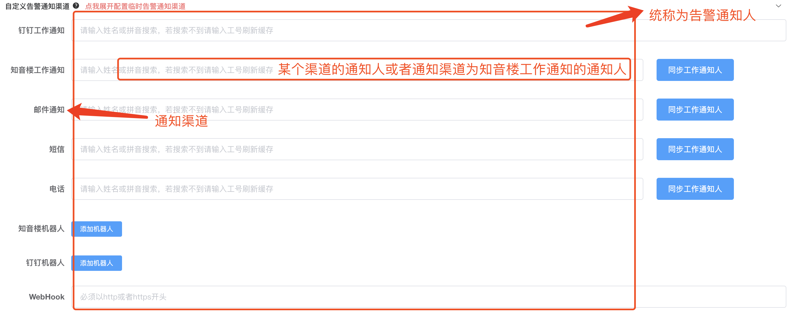

## 监控

监控是对异常状态的一种采集行为，比如根据在网关日志中判断状态是否大于等于500，比如在服务器中判断内存使用率是否大于50%，比如在代码中判断是否产生异常，这些都是监控行为。监控负责异常信息的产生。

## 告警

告警是对异常信息分发的一种行为，不具备异常信息产生能力，比如在代码中埋点将异常信息发送到哮天犬，这个发送异常信息的过程就是告警，代码中埋点try catch是监控，请注意区分监控与告警的概念。

## 通知人

通知人指的是哮天犬中配置的七种通知渠道的配置信息，合并成为通知人，而不是特定为某一个告警接收人或者接收渠道，如下图所示：

  

## 通知渠道

通知渠道指发送告警的渠道，比如短信、电话、邮箱、钉钉工作通知、钉钉机器人、知音楼工作通知、知音楼机器人等。

## 分级告警

分级告警指根据一定条件将告警调度到不同的通知人的功能，详情请参考 [分级告警]

## 告警收敛

告警收敛指根据一定条件将告警压缩为同一类告警，并且在一定周期或者设定条件内发送有限告警条数，有效避免重复告警发送的功能，详情请参考 [告警收敛]

## JSON数据类型
