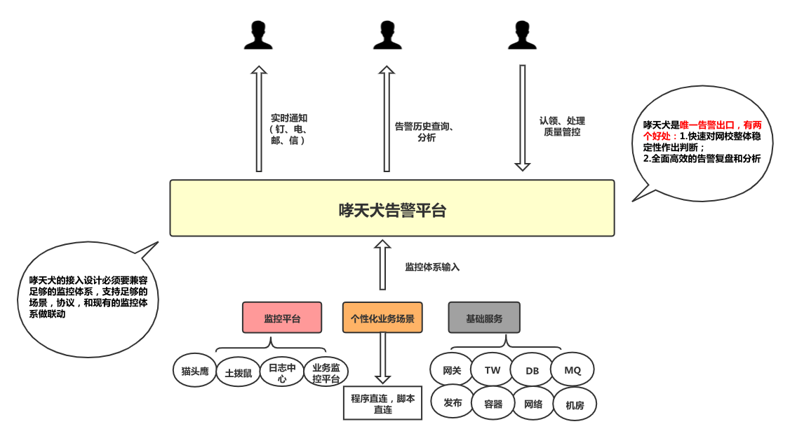
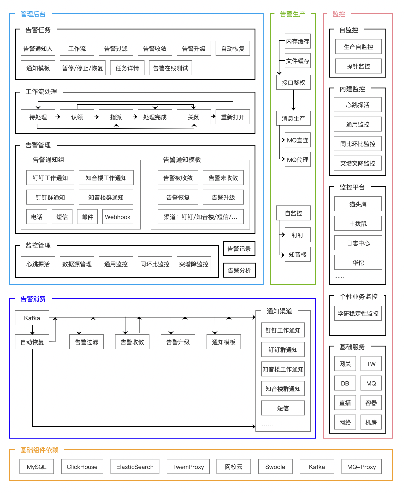
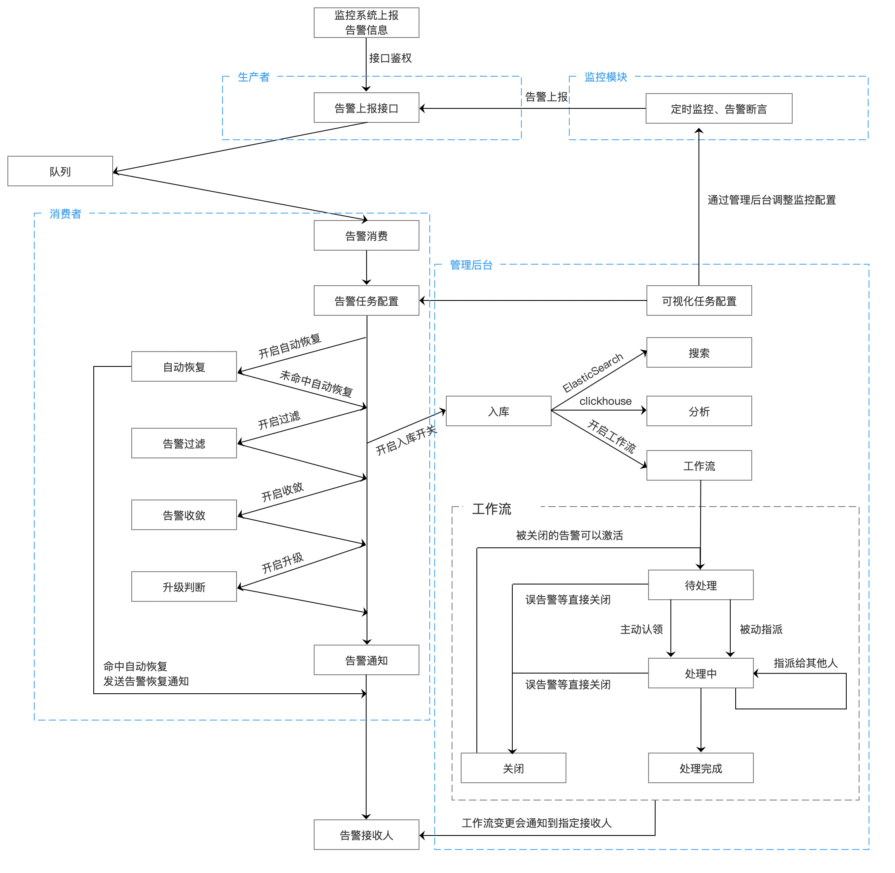

作为监控告警系统的最后一环，哮天犬作为告警平台，承接各监控系统的接入，必须要兼容各监控系统，支持足够多的场景，形成标准化的告警平台，统一输入，不同输出。

  

哮天犬主要分为以下四大模块以及依赖的基础组件：

  

模块之前的流程图如下图所示：

  

### 管理后台

管理后台负责告警任务配置、告警回放、分析、工作流等告警相关功能，以及监控任务配置、监控回放等功能，是哮天犬功能输出的可视化工具，底层使用MySQL、ElasticSearch、Clickhouse作为数据支撑，满足基本存储、搜索分析、备份等功能。

### 生产者

生产者负责告警消息的生产，提供告警接口。作为暴露在外的接口，必须保证安全性，哮天犬告警接口要求必须使用对应任务的签名，并且签名自带过期机制，有效保证告警接口安全。其次还得保证高性能，生产者在内存中缓存鉴权信息，使用Swoole提供的协程、MQ提供的Http代理，使整个生产过程无数据库操作，全部协程化，单机QPS轻松突破2万。并且内置自监控，告警接口调用过程中发生任何异常，我们能迅速感知异常。

### 消费者

消费者负责告警消息的消费，使告警经过自动恢复、过滤、收敛、升级等功能之后，通过管理后台配置的通知渠道将告警发送到通知人手上，是告警多样化的核心。为了避免告警消费阻塞以及可控告警消费能力，消费者同样使用Swoole提供的协程、MQ提供的proxy，定时缓存任务配置到内存中，使整个告警消费过程高效、强大。

### 监控模块

监控模块提供心跳探活、基于数据源的监控等功能，是对常见监控场景的抽象化封装，快速无侵入式的对协议、数据源数据进行监控。
